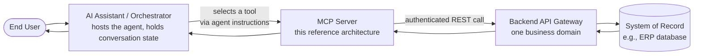
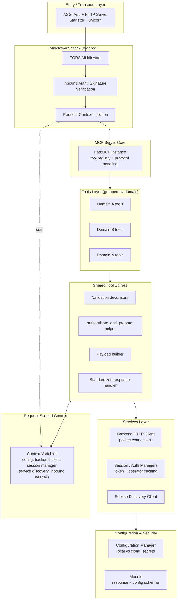
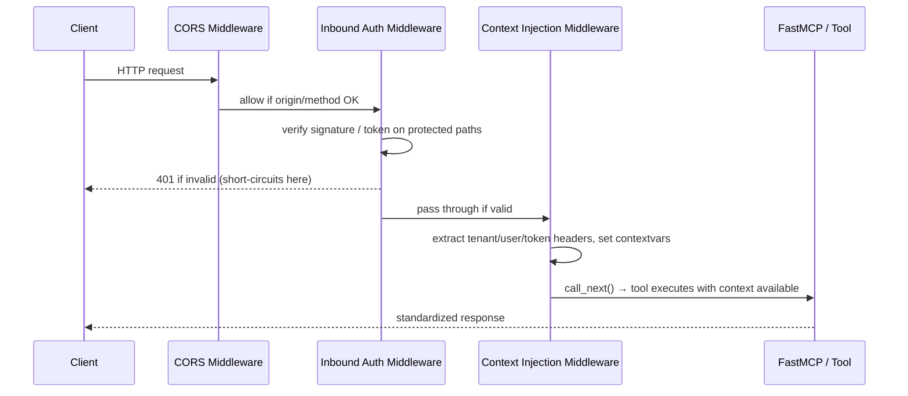
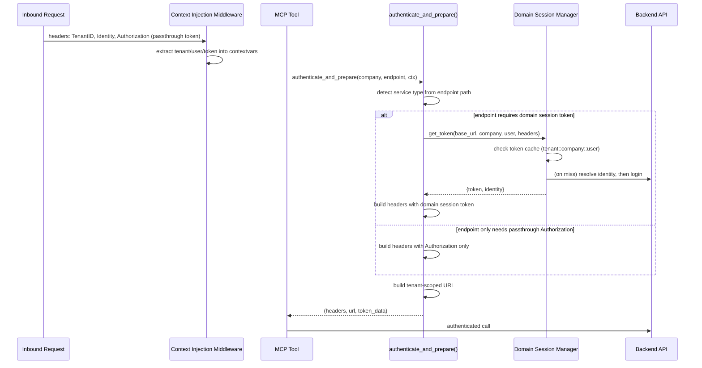
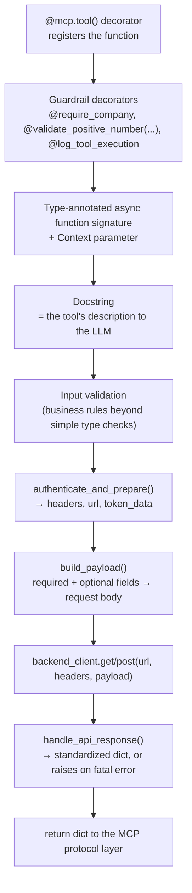
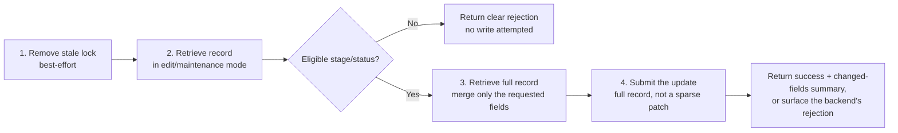
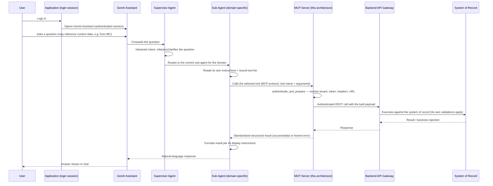

# MCP Server Reference Blueprint

*A reusable architecture reference for building production-grade Model Context Protocol (MCP) servers, derived from a live SX.e ERP integration server.*

---

## Table of Contents

1. [Executive Summary](#1-executive-summary)
2. [High-Level Architecture](#2-high-level-architecture)
3. [Technology Stack & Prerequisites](#3-technology-stack--prerequisites)
4. [Project Structure (the Standard)](#4-project-structure-the-standard)
5. [The Base Layer / Foundation](#5-the-base-layer--foundation)
6. [Authentication & Multi-Tenancy](#6-authentication--multi-tenancy)
7. [The Tool Pattern (One Endpoint = One Tool)](#7-the-tool-pattern-one-endpoint--one-tool)
8. [Adding a New Domain, Endpoint, and Tool](#8-adding-a-new-domain-endpoint-and-tool)
9. [Agents vs Tools (the Assistant-Platform Side)](#9-agents-vs-tools-the-assistant-platform-side)
10. [Configuration & Environments](#10-configuration--environments)
11. [Deployment & Operations](#11-deployment--operations)
12. [Testing Strategy](#12-testing-strategy)
13. [Conventions, Best Practices & Pitfalls](#13-conventions-best-practices--pitfalls)
14. [From-Scratch Build Checklist](#14-from-scratch-build-checklist)
15. [Appendix: Copy-Ready Templates](#15-appendix-copy-ready-templates)
16. [End-to-End Production Flow (a Real Walkthrough)](#16-end-to-end-production-flow-a-real-walkthrough)
17. [Companion Prompt — Handing This Off to Another Team's AI Model](#17-companion-prompt--handing-this-off-to-another-teams-ai-model)

---

## 1. Executive Summary

### 1.1 What is an MCP server, in plain terms

The **Model Context Protocol (MCP)** is an open standard that lets an AI assistant (the "host," e.g., a GenAI chat platform) call external capabilities — called **tools** — in a structured, discoverable way. An **MCP server** is the program that exposes those tools. Each tool is a well-described function: it has a name, a set of typed input parameters, and a docstring that tells the AI *when* and *why* to call it. Instead of an AI trying to guess how to call a raw REST API, it reads the tool's description and calls it like a function — the MCP server handles everything else (authentication, request building, calling the real backend, and shaping the response).

Think of it as a **translation and safety layer**: the business backend keeps its existing API, validations, and permission model untouched; the MCP server exposes a curated, well-documented subset of that API as callable "actions" an AI can use conversationally.

### 1.2 What this reference server does, and where it sits

The reference implementation is a **Python/FastMCP server** that sits between:

- **Upstream:** a GenAI orchestrator/assistant platform (the "host"), which routes a user's natural-language question to an **agent** (a set of instructions, external to this server) that decides which **tool** to call.
- **Downstream:** a single backend API gateway for one business domain — in the reference case, an ERP system's REST API (reached through an API gateway that also performs service discovery and identity resolution).

```
[ User ] → [ Assistant / Orchestrator ] → [ Agent instructions ] → [ MCP Server (this) ] → [ Backend API Gateway ] → [ Backend System of Record ]
```

The MCP server's only job is: **receive a tool call → authenticate → call the real backend endpoint → return a clean, predictable result.** It does not contain business logic, does not decide *when* to be called (that is the agent's job), and does not bypass any validation the backend already enforces.

### 1.3 Core design philosophy

- **Thin tools over one gateway.** Every tool is a small, focused wrapper around exactly one backend REST endpoint. No tool re-implements business logic; it delegates entirely to the backend and passes through its rules and errors.
- **Authenticate once, reuse everywhere.** A single shared helper resolves identity, tenant, and a valid access token/session and builds ready-to-use headers + URL. Every tool calls this helper first; no tool manages its own auth.
- **One endpoint = one tool.** This keeps each tool's behavior small, predictable, and easy for an LLM to reason about — a vague, multi-purpose tool leads to incorrect tool selection by the AI.
- **Config-driven, not code-driven, environment behavior.** Local development vs. cloud deployment is chosen by a small **factory** layer and configuration values, never scattered `if` statements throughout business code.
- **Stateless and horizontally scalable.** The server keeps no conversation state between requests; all per-request data lives in short-lived, request-scoped context that is set at the start of a request and cleared at the end. This allows the server to scale out behind a load balancer with no session affinity.
- **Multi-tenant by construction.** Tenant, user identity, and company context are extracted from the inbound request on every call — never hardcoded, never assumed from a previous request.
- **Honest error surfacing.** The server never fabricates success. Backend business-rule rejections and transport failures are surfaced to the caller (and ultimately the end user) as-is, not masked or silently retried.

### 1.4 Who should read this document

| Reader | What to focus on |
|---|---|
| Engineers new to MCP | Sections 1, 2, 7, 9 — the concepts and the tool pattern |
| Engineers building the new server | Sections 4, 5, 6, 8, 10, 11, 14, 15 — structure, foundation, and the build checklist |
| An AI coding agent generating the new server | The entire document, especially Sections 5, 7, 14, and 15 (templates) |
| Reviewers / architects | Sections 2, 6, 13 — architecture, security model, and pitfalls |

---

## 2. High-Level Architecture

### 2.1 Component diagram



The MCP server is a **stateless intermediary**. It never talks to the end user directly and never talks to the system of record directly — it always goes through the backend's own API gateway, which continues to enforce that system's business rules, permissions, and data validations.

### 2.2 Layered internal architecture



### 2.3 The critical separation: server exposes tools, agents decide

This is the single most important architectural boundary in the whole system:

| | MCP Server (this repository) | Agent Instructions (external assistant platform) |
|---|---|---|
| **What it is** | Python code: tools, auth, config, backend calls | A YAML/text instruction set authored for the assistant platform |
| **What it decides** | *How* to execute a specific action against the backend | *Which* tool to call for a given user utterance, in what order, with what confirmation |
| **Where it lives** | This codebase, deployed as its own service | The assistant/orchestrator platform's agent configuration |
| **Analogy** | The **hands** — it can perform an action when told to | The **brain's rulebook** — it decides when and how to use the hands |
| **Changes when...** | A backend endpoint changes, or a new domain capability is added | The conversational behavior, routing, or safety rules change |

A new team adopting this architecture for a different business domain builds the **server** described in this document. The **agent instructions** for their new server are authored separately, in whatever assistant platform they use, and are out of scope for this document except where Section 9 explains the contract between the two.

> For a concrete, real-world walkthrough of how this separation plays out end to end in production — login, supervisor/sub-agent routing, tool call, this server, the backend, and back to natural language — see **Section 16 — End-to-End Production Flow**.

---

## 3. Technology Stack & Prerequisites

### 3.1 Stack overview

| Layer | Technology (reference) | Why |
|---|---|---|
| Language runtime | Python 3.11+ (containerized on 3.14-slim) | Async-first, huge ecosystem, fast to iterate |
| MCP framework | **FastMCP** | Turns a decorated Python async function into a fully-specified MCP tool (schema generated from type hints + docstring) with minimal boilerplate |
| ASGI web framework | **Starlette** | Lightweight, async-native; used to assemble middleware, routes, and lifespan around the FastMCP app |
| ASGI server | **Uvicorn** | Production-grade ASGI server; supports SSL, graceful shutdown, signal handling |
| Data validation | **Pydantic v2** | Typed configuration and response models; validation with clear errors |
| Async HTTP client | **httpx** (with connection pooling) | Async-native, supports connection reuse, timeouts, HTTP/2-ready |
| Cloud SDK / secrets | **boto3** (AWS KMS + Secrets Manager) | Decrypts environment-injected ciphertext and fetches rotated credentials in cloud deployments |
| Environment loading | **python-dotenv** | Loads local `.env` files for local development only |
| Testing | **pytest**, **pytest-asyncio**, **hypothesis**, **moto** | Unit/integration tests, async test support, property-based testing, mocked AWS services |
| Containerization | Docker (slim Python base image) | Reproducible builds; small attack surface |
| Orchestration | Kubernetes (Deployment, Service, HPA, PDB) | Horizontal scaling, rolling deploys, autoscaling, disruption budgets |

> **Note:** The specific cloud SDK (`boto3`) and secret manager (AWS KMS/Secrets Manager) are AWS-specific choices in the reference implementation. A new team on a different cloud provider should substitute their equivalent (e.g., Azure Key Vault, GCP Secret Manager) while keeping the same *pattern*: environment variables carry either plaintext or ciphertext, and a small client class handles decryption.

### 3.2 Prerequisites before starting

- Python 3.11+ installed locally.
- Access to (or a mock of) the target backend API gateway for your business domain, including a way to obtain sandbox/test credentials.
- An identity/auth mechanism for your backend (OAuth2 client credentials, OAuth2 password grant, API key, or token passthrough — see Section 6).
- A container registry and Kubernetes cluster (or equivalent) for deployment, if going beyond local development.
- Access to the assistant/orchestrator platform where agent instructions will eventually be authored (not required to start building the server itself).

### 3.3 Pinned dependency list template

```text
# --- MCP & web framework ---
fastapi==0.127.0            # Used transitively by FastMCP tooling / OpenAPI-style schema utilities
fastmcp>=2.14.0             # Core MCP server framework: tool registration, protocol handling
uvicorn[standard]==0.40.0   # ASGI server (with uvloop/httptools extras)
pydantic==2.12.5            # Typed config & response models, validation

# --- HTTP & networking ---
httpx>=0.28.1               # Async HTTP client with connection pooling
urllib3==2.2.3               # Transitive dependency pin (security/compatibility)

# --- Cloud / secrets (swap for your provider) ---
boto3==1.42.14               # AWS SDK: KMS decryption + Secrets Manager

# --- Local development ---
python-dotenv>=1.0.0         # Load .env for local runs
watchdog>=3.0.0               # Optional: file-watching for local dev tooling
psutil>=5.9.0                 # Optional: process/resource introspection for monitoring endpoints

# --- Testing ---
pytest==9.0.2
pytest-asyncio==1.3.0
hypothesis==6.148.7           # Property-based testing
moto==5.1.18                  # Mock AWS services (KMS, Secrets Manager) in tests
```

Pin exact versions for anything that ships to production (framework, web server, validation, HTTP client, cloud SDK). Testing-only libraries can be pinned loosely if your CI tolerates it, but pinning everything is the safer default.

---

## 4. Project Structure (the Standard)

### 4.1 Full folder tree

```text
mcpserver/
├── main.py                        # Entry point: ASGI app, middleware, lifespan, routes
├── requirements.txt                # Pinned Python dependencies
├── dockerfile                      # Container build definition
├── entrypoint.sh                    # Container entrypoint script
├── k8s-deployment.yaml              # Kubernetes manifests (Deployment/Service/HPA/PDB)
├── application-properties-mapping.json  # Env-var → internal-config-key mapping (cloud mode)
├── pytest.ini                        # Test runner configuration
├── .env                              # Local-only environment overrides (never committed with real secrets)
├── ssl/                              # Local SSL cert/key (optional, local HTTPS testing)
├── ci/                                # CI/CD pipeline support files
│
├── app/                               # All application source code
│   ├── server.py                     # FastMCP instance + tool module imports (registration)
│   ├── context.py                    # Request-scoped context variables (contextvars-based DI)
│   ├── __init__.py
│   │
│   ├── config/                       # Everything configuration & secrets
│   │   ├── constants.py              # ServiceDiscoveryKeys, <Backend>ApiEndpoints, timeouts, cache TTLs
│   │   ├── environment.py            # is_cloud_environment(), local config loader
│   │   ├── manager.py                # ConfigurationManager: local vs cloud loading, KMS/Secrets Manager
│   │   ├── kms_client.py             # AWS KMS decrypt wrapper (swap per cloud provider)
│   │   └── oauth2_config.py          # Parses local credential file (e.g., *.ionapi equivalent)
│   │
│   ├── models/                       # Typed data models (Pydantic / dataclasses)
│   │   ├── config.py                 # ConfigMapping, ServiceConfig (properties-mapping schema)
│   │   └── response.py               # BackendResponse (standardized backend call result)
│   │
│   ├── security/                     # Inbound request security
│   │   ├── middleware.py             # OAuth1Middleware (or your inbound auth scheme)
│   │   └── oauth1.py                 # Signature verification implementation
│   │
│   ├── services/                     # Outbound integration & infrastructure services
│   │   ├── discovery.py              # ServiceDiscoveryClient (cloud: dynamic URL resolution)
│   │   ├── factory.py                # create_session_manager / create_service_discovery_client
│   │   ├── session.py                # SessionManager (cloud: OAuth2 client-credentials)
│   │   ├── session_sxe.py            # Backend-specific session manager (token + operator caching)
│   │   ├── backend_client.py         # BackendServiceClient (domain-facing HTTP wrapper)
│   │   ├── http_client.py            # HTTPClientManager (pooled httpx client, low-level)
│   │   ├── mixins.py                 # HTTPClientMixin (shared pooled-client access)
│   │   ├── sxe_context.py            # Context helpers: tenant/user extraction, header/URL building
│   │   └── quote_session.py          # Example of a domain-specific stateful helper (if needed)
│   │
│   ├── local/                        # Local-development-only implementations
│   │   ├── README.md
│   │   ├── credentials/              # Local credential file(s) + .gitignore (never commit real creds)
│   │   └── services/                 # LocalSessionManager, LocalServiceDiscoveryClient
│   │
│   ├── tools/                        # All MCP tools, grouped by business domain
│   │   ├── util.py                   # Shared decorators + helpers used by every tool
│   │   ├── __init__.py               # Imports every domain package (triggers registration)
│   │   ├── _shared/                  # Cross-domain shared tool logic (if any)
│   │   ├── <domain_a>/               # One folder per business domain
│   │   │   ├── __init__.py           # Imports every tool module in this domain
│   │   │   ├── <tool_one>.py         # One tool per file
│   │   │   └── <tool_two>.py
│   │   ├── <domain_b>/
│   │   └── ...
│   │
│   └── utils/                        # Small, generic, domain-agnostic helpers (rare; keep tiny)
│
├── docs/                              # Architecture docs, agent references, this blueprint
│
└── tests/                             # Test suite (see Section 12)
    ├── unit/
    ├── integration/
    ├── security/
    └── load/
```

### 4.2 Naming conventions

| Element | Convention | Example |
|---|---|---|
| Domain package | lowercase, singular or short noun, matches the business area | `tools/vendor/`, `tools/purchase_order/` |
| Tool file | one file per tool, snake_case, verb-first or descriptive | `get_pos_for_acknowledgment.py`, `update_po_line.py` |
| Tool function name | matches the file name; this becomes the MCP tool name the LLM sees | `async def get_pos_for_acknowledgment(...)` |
| Endpoint constants | `SCREAMING_SNAKE_CASE`, grouped by domain with a comment header | `PO_ACK_RETRIEVE`, `VENDOR_BALANCE_DISPLAY` |
| Config/service keys | dotted, lowercase, vendor-namespaced string constants | `infor.ionapi.url`, `infor.authsvc.clientid` |
| Environment variables (cloud) | `<service-code>.<area>.<property>` | `sxemcpsvc.authsvc.clientid` |
| Classes | PascalCase, suffixed by role | `ConfigurationManager`, `BackendServiceClient`, `SXESessionManager` |
| Async helper functions | snake_case, verb-first | `authenticate_and_prepare`, `build_payload`, `handle_api_response` |
| Decorators | snake_case, read like an English sentence | `@require_cono`, `@validate_positive_number('pono')`, `@log_tool_execution` |

### 4.3 Why this structure

- **`config/` is the only place that knows about environments and secrets.** Nothing outside it should call `os.getenv` directly for anything security- or environment-sensitive — this keeps secret handling auditable in one place.
- **`services/` holds infrastructure, not business logic.** HTTP pooling, session/token management, and service discovery are reusable regardless of business domain — this is the layer a new team keeps almost unchanged.
- **`tools/<domain>/` mirrors the backend's own domain boundaries**, not the AI's conversational structure. This keeps a one-to-one mental map between "the backend has an Accounts Payable module" and "we have a `vendor/` or `accounts_payable/` tool package," which is easier to maintain as the backend evolves.
- **One tool per file** keeps code review, testing, and LLM-facing documentation (the docstring) focused and small. It also means adding a tool never requires touching another tool's file.
- **`local/` isolates environment-specific implementations** behind the same interface as their cloud counterparts (see the Factory pattern in 5.6–5.7), so business/tool code never branches on environment.
- **`app/tools/util.py` is the single shared utility module** every tool imports from — this is what prevents 20 tools from each re-implementing authentication, payload building, and error handling slightly differently.

---

## 5. The Base Layer / Foundation

This is the part of the system a new team should treat as a **template to copy and adapt**, keeping the same responsibilities and call sequence while swapping in their backend's specifics.

### 5.1 Entry point / application bootstrap

**Responsibilities:** create the ASGI app, wire the middleware stack in the correct order, define infrastructure routes (health, monitoring), initialize all shared services once at startup (not per-request), mount the MCP app, and handle graceful shutdown and OS signals.

**Key mechanisms observed in the reference implementation:**
- A module-level `app_state: dict` holds long-lived singletons (config manager, backend client, session managers, service discovery, OAuth1 credentials) — populated once during startup, read by middleware on every request.
- An `initialize_services()` async function performs startup work: load configuration → detect environment type → discover backend service URLs → construct the appropriate session manager (via the factory) → construct the backend HTTP client → construct the domain session manager → load inbound-auth secrets.
- FastMCP's own ASGI app (`mcp.http_app(...)`) is created with **stateless HTTP mode** enabled — this is what allows horizontal scaling with no session affinity, since no per-connection state is kept server-side between calls.
- A combined `lifespan` async context manager runs `initialize_services()` on startup, then delegates to FastMCP's own lifespan, and on shutdown calls a cleanup function for the pooled HTTP client and clears `app_state`.
- Infrastructure routes (`/healthcheck`, `/monitoring/*`) are defined as small `async def` Starlette route handlers and registered directly on the `Starlette(routes=[...])` app — separate from the MCP tool routes, which FastMCP mounts itself.
- The MCP app is **mounted** onto the root Starlette app (`Mount("/", app=mcp_app)`), so the outer app's middleware (CORS, inbound auth, context injection) wraps every MCP call as well as the infrastructure routes.
- `if __name__ == "__main__":` block registers `SIGINT`/`SIGTERM` handlers for graceful shutdown, reads `PORT` from environment, optionally enables SSL if certificate files exist and `SSL_ENABLED=true`, and starts Uvicorn with `timeout_graceful_shutdown` configured so in-flight requests are allowed to finish.

**Minimal template:**

```python
# main.py
import os, signal, sys
from contextlib import asynccontextmanager
import uvicorn
from starlette.applications import Starlette
from starlette.routing import Route, Mount
from starlette.responses import JSONResponse
from starlette.middleware import Middleware
from starlette.middleware.cors import CORSMiddleware
from starlette.middleware.base import BaseHTTPMiddleware

from app.server import mcp
from app.context import set_request_context
from app.config.manager import ConfigurationManager
from app.services.factory import create_session_manager, create_service_discovery_client
from app.services.backend_client import BackendServiceClient
from app.services.http_client import cleanup_http_client
from app.security.middleware import InboundAuthMiddleware  # your inbound-auth scheme

app_state: dict = {}

async def initialize_services():
    config_manager = ConfigurationManager()
    config_manager.load_configuration()
    app_state["config_manager"] = config_manager

    environment_type = config_manager.get_config_value("<ENV_TYPE_KEY>") or "cloud"

    service_discovery = create_service_discovery_client(environment_type, ...)
    await service_discovery.discover_services()
    app_state["service_discovery"] = service_discovery

    session_manager = create_session_manager(environment_type, ...)
    app_state["session_manager"] = session_manager

    app_state["backend_client"] = BackendServiceClient()
    # + your backend-specific session/token manager, if applicable

async def healthcheck(request):
    return JSONResponse({"status": "healthy", "service": "<your-mcp-server>"})

class ContextInjectionMiddleware(BaseHTTPMiddleware):
    async def dispatch(self, request, call_next):
        headers = {}  # extract tenant/user/token headers here for MCP requests only
        set_request_context(
            config_manager=app_state.get("config_manager"),
            backend_client=app_state.get("backend_client"),
            service_discovery=app_state.get("service_discovery"),
            inbound_headers=headers,
        )
        return await call_next(request)

mcp_app = mcp.http_app(path="/api/v1/mcp", stateless_http=True)

@asynccontextmanager
async def combined_lifespan(app):
    await initialize_services()
    async with mcp_app.router.lifespan_context(app) as state:
        if state:
            app.state.update(state)
        yield
    await cleanup_http_client()
    app_state.clear()

app = Starlette(
    routes=[
        Route("/healthcheck", healthcheck, methods=["GET"]),
        Mount("/", app=mcp_app),
    ],
    middleware=[
        Middleware(CORSMiddleware, allow_origins=["*"], allow_methods=["*"], allow_headers=["*"]),
        Middleware(InboundAuthMiddleware, app_state=app_state),
        Middleware(ContextInjectionMiddleware),
    ],
    lifespan=combined_lifespan,
)

if __name__ == "__main__":
    signal.signal(signal.SIGINT, lambda s, f: sys.exit(0))
    signal.signal(signal.SIGTERM, lambda s, f: sys.exit(0))
    uvicorn.run(app, host="0.0.0.0", port=int(os.getenv("PORT", "8443")),
                timeout_graceful_shutdown=5)
```

### 5.2 Middleware stack and order

**Order matters and is deliberate.** In the reference implementation, requests pass through middleware in this sequence:



1. **CORS middleware (outermost).** Handles preflight `OPTIONS` and sets `Access-Control-*` headers. Runs first so that browser preflight requests never reach auth logic.
2. **Inbound authentication / signature verification.** Validates that the caller (typically the orchestrator platform itself, not the end user directly) is a legitimate caller of this server — e.g., HMAC signature verification, a shared secret, or mTLS. Only applied to a configured set of **protected paths**. Returns `401` immediately on failure, before any tool code runs.
3. **Request-context injection (innermost, closest to the app).** Extracts tenant ID, user identity, and any passthrough authorization token from inbound headers and stores them in request-scoped context variables (Section 5.4) so tools can retrieve them without threading parameters through every function call.

**Why this order:** CORS must run before anything else so malformed/disallowed browser requests are rejected cheaply. Inbound auth must run before context injection so that unauthenticated requests never get a context set up (avoiding wasted work and reducing the attack surface). Context injection must be last (closest to the actual tool execution) so it has the final, already-authenticated request to read from.

### 5.3 MCP server instance and tool registration mechanism

**`app/server.py`** creates exactly one `FastMCP` instance for the whole process and then imports every tool-domain package:

```python
# app/server.py
from fastmcp import FastMCP
import logging

logger = logging.getLogger(__name__)

mcp = FastMCP("<your-mcp-server-name>")

# Importing each domain package executes its tool modules, which run the
# @mcp.tool() decorator at import time — this is what "registers" them.
from app.tools import domain_a
from app.tools import domain_b
# ... one import per domain

logger.info("Tools registered")
```

**How registration actually works:** FastMCP's `@mcp.tool()` decorator, applied to an `async def` function, introspects the function's **type-annotated parameters** and its **docstring** to automatically generate the MCP tool schema (name, parameter types/descriptions, required vs optional, and the tool's overall description). No separate schema file or manual JSON schema is maintained — the Python signature and docstring **are** the contract the AI sees. This is why docstring quality is treated as a first-class concern (Section 7).

Because Python only runs decorator code when a module is *imported*, a tool that is never imported (directly or via its domain package's `__init__.py`) is **not visible to the MCP protocol**, even if the file exists. Every domain package's `__init__.py` must import all of its tool modules, and `app/tools/__init__.py` (or `app/server.py` directly) must import every domain package.

### 5.4 Request-scoped context (thread-safe, no globals)

**Problem it solves:** an MCP server handles many concurrent requests from different tenants/users. Passing `cono`, `tenant_id`, `backend_client`, etc. through every function call is unwieldy, and using plain module-level globals is unsafe under concurrency (one request's data could leak into another's).

**Solution:** Python's `contextvars.ContextVar`, which is **coroutine/task-scoped** — each concurrent request (each `asyncio` task) sees its own isolated value, even though the variable is declared once at module level.

```python
# app/context.py
from contextvars import ContextVar
from typing import Optional, Dict

_config_manager: ContextVar = ContextVar('config_manager', default=None)
_backend_client: ContextVar = ContextVar('backend_client', default=None)
_service_discovery: ContextVar = ContextVar('service_discovery', default=None)
_inbound_headers: ContextVar = ContextVar('inbound_headers', default=None)

def set_request_context(config_manager, backend_client, service_discovery, inbound_headers: Dict[str, Optional[str]]):
    _config_manager.set(config_manager)
    _backend_client.set(backend_client)
    _service_discovery.set(service_discovery)
    _inbound_headers.set(inbound_headers)

def get_backend_client():
    client = _backend_client.get()
    if client is None:
        raise RuntimeError("BackendServiceClient not available in context")
    return client

# ... one getter per context variable, each raising a clear RuntimeError if unset

def clear_request_context():
    _config_manager.set(None)
    _backend_client.set(None)
    _service_discovery.set(None)
    _inbound_headers.set(None)
```

**Lifecycle:** the context-injection middleware (5.2) calls `set_request_context(...)` at the start of every request. Tools call the `get_*()` accessors on demand. There is no explicit "memory leak" risk because `ContextVar` values are scoped to the async task and are garbage-collected when the task completes; the reference implementation additionally exposes `clear_request_context()` for explicit cleanup/tests. **Never** store request-scoped data (tenant ID, tokens, per-request objects) in a plain module-level variable or a class attribute shared across requests — that is the #1 way to leak one tenant's data into another tenant's request under concurrency.

### 5.5 Configuration management

**Responsibilities:** load configuration from the right source depending on environment, centralize all endpoint paths and service keys, and decrypt secrets where needed — without any of that logic leaking into tool code.

**Key design:**
- **Environment detection** is a single boolean function (e.g., `is_cloud_environment()`), typically based on the presence of a cloud-only environment variable (in the reference implementation, an AWS region variable). Every other component asks this function; nothing re-implements the check.
- **Local mode:** configuration is loaded either from a local credentials file (e.g., a downloaded OAuth client-credential file) or from hardcoded development defaults, plus a couple of OAuth-related values from a local `.env` file.
- **Cloud mode:** a `ConfigurationManager` reads a **properties-mapping JSON file** that declares, for each expected environment variable: its external env-var name, its internal application-config key, whether it's required, and an optional encryption context. For each mapping, the manager reads the environment variable; if its value is prefixed with a marker (e.g., `kmsciphertext:`), it is base64-decoded and decrypted via the cloud KMS client using the declared encryption context; otherwise it's used as plaintext. A few additional secrets (e.g., OAuth client id/secret) are fetched directly from a cloud secrets store (e.g., AWS Secrets Manager) using a deployment-specific secret path, with environment variables taking priority if already present.
- All resolved values are stored in one internal dict, retrieved everywhere else via `get_config_value(key)` — callers never know or care whether a value came from an env var, a decrypted ciphertext, or a secrets-manager lookup.

**Properties-mapping file shape (example):**

```json
{
  "service-code": "<your-service-code>",
  "mappings": [
    {
      "environment-property-name": "<yourservice>.discoverysvc.url",
      "application-property-name": "internal.discoverysvc.url",
      "required": true,
      "encryption-context": "discoverysvc.url"
    },
    {
      "environment-property-name": "<yourservice>.authsvc.clientsecret",
      "application-property-name": "internal.authsvc.clientsecret",
      "required": false,
      "encryption-context": "client_secret"
    }
  ]
}
```

**Minimal template:**

```python
# app/config/manager.py
import os, json
from app.config.environment import is_cloud_environment, get_local_config
from app.config.kms_client import KMSClient

class ConfigurationManager:
    def __init__(self, mapping_file_path: str = "application-properties-mapping.json"):
        self.mapping_file_path = mapping_file_path
        self._config: dict = {}
        self._is_loaded = False

    def load_configuration(self) -> None:
        if is_cloud_environment():
            self._load_cloud_configuration()
        else:
            self._config = get_local_config()
        self._is_loaded = True

    def _load_cloud_configuration(self) -> None:
        mapping = json.load(open(self.mapping_file_path))
        kms = KMSClient(region_name=os.getenv("SERVICE_CONF_REGION_NAME", "<default-region>"))
        for m in mapping["mappings"]:
            env_val = os.getenv(m["environment-property-name"])
            if env_val is None:
                if m["required"]:
                    raise ValueError(f"Missing required env var: {m['environment-property-name']}")
                continue
            if env_val.startswith("kmsciphertext:"):
                plaintext = kms.decrypt(env_val[len("kmsciphertext:"):],
                                         {"Key": m["encryption-context"]} if m["encryption-context"] else None,
                                         True)
                self._config[m["application-property-name"]] = plaintext
            else:
                self._config[m["application-property-name"]] = env_val
        # + fetch any remaining secrets directly from your secrets manager here

    def get_config_value(self, key: str):
        if not self._is_loaded:
            raise RuntimeError("Configuration not loaded")
        return self._config.get(key)
```

**Endpoint constants** live in a dedicated module (e.g., `app/config/constants.py`) as plain string class attributes, grouped by domain with comments — this is the *single source of truth* for every backend path a tool can call:

```python
class BackendApiEndpoints:
    # Authentication
    LOGIN = "/api/login"
    # Domain A
    DOMAIN_A_LIST = "/api/domain-a/list"
    DOMAIN_A_UPDATE = "/api/domain-a/update"
```

### 5.6 Service discovery

**Purpose:** resolve the backend's real base URL (and possibly other service URLs) at runtime instead of hardcoding it, so the same code works across environments (dev/test/prod) without a code change.

**Local vs cloud, via the Factory pattern:** rather than branching on environment type inside business logic, a small **factory function** decides which concrete implementation to construct:

```python
# app/services/factory.py
def create_service_discovery_client(environment_type: str, discovery_url: str, ionapi_url: str | None = None, **kwargs):
    if environment_type == "local":
        return LocalServiceDiscoveryClient(discovery_url, ionapi_url, **kwargs)  # returns a fixed/known URL
    return ServiceDiscoveryClient(discovery_url, **kwargs)  # calls a real discovery service over HTTP
```

- **Cloud implementation** (`ServiceDiscoveryClient`) calls a discovery service HTTP endpoint at startup, retrying with backoff on failure, and caches the returned map of `service_name → url` for the lifetime of the process.
- **Local implementation** typically short-circuits to a known/fixed URL (e.g., parsed from a local credentials file) since there is no discovery service running in a laptop dev environment.
- Both implementations expose the **same interface** (`discover_services()`, `get_service_url(name)`), so calling code never needs to know which one is active.

### 5.7 Session / authentication managers

Two related but distinct concerns exist in the reference implementation, and a new team should keep them distinct too:

**(a) Getting *this server's own* credential to call the backend gateway** — an OAuth2 **client-credentials** flow (cloud) or OAuth2 **password grant** (local, for developer convenience), selected again via the factory pattern:

```python
def create_session_manager(environment_type: str, auth_url: str, client_id: str, client_secret: str,
                            username: str | None = None, password: str | None = None, **kwargs):
    if environment_type == "local":
        return LocalSessionManager(auth_url, client_id, client_secret, username, password, **kwargs)
    return SessionManager(auth_url, client_id, client_secret, **kwargs)
```

This is the server's own service identity — used only as a **fallback** when there is no per-user token to pass through (see below).

**(b) Token passthrough vs. client-credentials — choosing per request, not per deployment:**

The reference implementation prefers **passthrough**: if the inbound request already carries a valid, user-scoped bearer token (placed there by the upstream gateway/orchestrator, which already authenticated the real end user), the MCP server **reuses that token as-is** for its outbound call. This preserves the original user's actual permissions end-to-end. Only if no such token is present does the server fall back to its own client-credentials token from (a). This fallback exists for resilience/testing, not as the primary path — production traffic should always carry a passthrough token so that backend authorization reflects the real end user, not a generic service identity.

**(c) Backend-domain session state (a second, backend-specific layer).** Some backends require more than a bearer token — e.g., a domain login call that returns a **session token**, tied to a specific tenant *and* company *and* user, plus resolution of an **operator/user identity** on the backend side. The reference implementation's `SXESessionManager` handles exactly this:

- Maintains two **in-memory caches with independent TTLs**: a token cache (short TTL, e.g., 1 hour) keyed by `tenant::company::user`, and an operator cache (long TTL, e.g., 24 hours) keyed by `tenant::user` — because operator resolution is comparatively expensive (a dedicated lookup call) and changes far less often than a session token.
- **Never accepts a hardcoded/guessed operator.** If no operator is explicitly supplied, it is fetched from a backend API call that returns the operator implied by the caller's own authenticated identity — this is a deliberate anti-impersonation measure: the code path that would let a caller specify an arbitrary operator is intentionally not the default.
- On a cache miss, performs the backend's login call with the resolved company + operator, caches the resulting token, and returns it.
- Exposes `clear_cache()` / `clear_token()` / `get_cache_stats()` for operational visibility (used by the monitoring endpoint in Section 11).

**Minimal template (domain session/token manager):**

```python
import time
from dataclasses import dataclass

@dataclass
class CachedToken:
    token: str
    identity: str
    expires_at: float
    def is_expired(self) -> bool:
        return time.time() >= self.expires_at

class DomainSessionManager:
    def __init__(self, backend_client, token_ttl_seconds=3600, identity_ttl_seconds=86400):
        self.backend_client = backend_client
        self.token_ttl_seconds = token_ttl_seconds
        self.identity_ttl_seconds = identity_ttl_seconds
        self._token_cache: dict[str, CachedToken] = {}
        self._identity_cache: dict[str, tuple[str, float]] = {}

    async def get_token(self, base_url, tenant_id, company, user_id, headers, identity: str | None = None) -> dict:
        cache_key = f"{tenant_id}::{company}::{user_id}"
        cached = self._token_cache.get(cache_key)
        if cached and not cached.is_expired():
            return {"token": cached.token, "identity": cached.identity}

        if not identity:
            identity = self._get_cached_identity(tenant_id, user_id) or await self._fetch_identity_from_api(base_url, headers)

        token = await self._login_and_get_token(base_url, tenant_id, company, identity, headers)
        self._token_cache[cache_key] = CachedToken(token, identity, time.time() + self.token_ttl_seconds)
        return {"token": token, "identity": identity}
```

### 5.8 Backend / HTTP client

**Two layers, deliberately separated:**

1. **Low-level pooled HTTP client (`HTTPClientManager`)** — a thin wrapper around `httpx.AsyncClient`, configured once with connection-pool limits (max total connections, max keep-alive connections, keep-alive expiry) and a default timeout. It is a **process-wide singleton**, lazily created on first use with a double-checked lock, and exposes `get/post/put/delete` convenience methods plus `get_client_stats()` for the monitoring endpoint. It tracks request counts, success/failure counts, and average response time.
2. **Domain-facing backend client (`BackendServiceClient`)** — wraps the pooled client and is what tools actually depend on. It converts every raw `httpx.Response` into a **standardized response object** so tool code never has to special-case transport errors vs. HTTP error bodies:

```python
# app/models/response.py
from dataclasses import dataclass
from typing import Any, Optional

@dataclass
class BackendResponse:
    success: bool
    data: Optional[Any] = None
    error: Optional[str] = None
    status: int = 200
```

```python
# app/services/backend_client.py (essential shape)
class BackendServiceClient:
    async def post(self, url, headers, data=None) -> BackendResponse:
        return await self.make_request("POST", url, headers, data=data)

    async def make_request(self, method, url, headers, data=None, params=None) -> BackendResponse:
        try:
            response = await self.http_manager.make_request(method, url, headers=headers, json_data=data, params=params)
            return self.handle_response(response)
        except httpx.TimeoutException as e:
            return BackendResponse(success=False, error=f"Request timeout: {e}", status=408)
        except httpx.HTTPError as e:
            return BackendResponse(success=False, error=f"HTTP error: {e}", status=500)

    def handle_response(self, response) -> BackendResponse:
        status = response.status_code
        try:
            data = response.json()
        except ValueError:
            data = {"message": response.text}
        if 200 <= status < 300:
            return BackendResponse(success=True, data=data, status=status)
        return BackendResponse(success=False, error=self._extract_error_message(data, status), status=status)
```

This gives every tool the same three fields to check — `success`, `data`, `error` — regardless of whether the failure was a network timeout, an HTTP error status, or a backend-specific business rejection embedded in a 200-ish response body (see Section 7 for how business rejections are surfaced).

### 5.9 Models

Two model families are used throughout:

- **Config models** (`app/models/config.py`) — typed Pydantic models describing the shape of the properties-mapping file (`ConfigMapping`, `ServiceConfig`), so a malformed mapping file fails fast with a clear validation error instead of a confusing `KeyError` deep in startup.
- **Response model** (`app/models/response.py`) — the single `BackendResponse` dataclass described in 5.8, which is the common currency every service and tool passes around instead of raw `httpx` objects or ad-hoc dicts.

Keep this layer intentionally small. Its job is to make the *shape* of configuration and backend responses explicit and typed — it is not where business/domain data models belong (those stay as plain dicts passed through from the backend, since the backend already owns their schema).

---

## 6. Authentication & Multi-Tenancy

### 6.1 Step-by-step: how a single tool call gets authenticated



1. **Tenant resolution.** The tenant identifier always comes from an **inbound header** set by the upstream gateway/orchestrator (in the reference implementation, a `TenantID` header) — never from a request body field, a hardcoded constant, or a previous request's cached value. In local development only, this may be overridden to a fixed configured value for developer convenience — that override must be explicitly gated behind an environment check, never active in cloud/production code paths.
2. **User/operator identity resolution.** The end user's identity comes from an inbound identity header (in the reference implementation, an `X-Infor-Identity2`-style header), parsed to extract a user id. Where the backend needs a *domain-specific* operator/user record (distinct from the platform identity), that operator is **resolved via a backend API call**, not supplied by the caller — this prevents a caller from claiming to be a different operator than they actually are.
3. **Token resolution — passthrough first.** If the inbound request already carries a per-user bearer token (the common case — the upstream gateway already authenticated the real user), that token is used as-is for the outbound call. Only if it's absent does the server fall back to its own service-level (client-credentials) token.
4. **Outbound header construction.** A single helper builds the final outbound headers: `Authorization` (from passthrough or fallback), the tenant header (mapped from the inbound header name to whatever the backend expects outbound — these are not always the same header name), and identity headers, with **no other request data ever string-interpolated into a header**.
5. **URL construction.** The backend base URL (from service discovery) is combined with the tenant id and the specific endpoint path to form the final URL: `{base_url}/{tenant_id}/{endpoint_path}`. The tenant id is taken from validated context, never from unsanitized user input, preventing path-injection into the URL.
6. **The call executes** using the backend client (5.8), and the standardized response is handed back to the tool.

### 6.2 The "authenticate once, then invoke tools" model

Every tool, regardless of domain, calls exactly **one shared helper** to get ready-to-use headers and URL — this is the load-bearing abstraction of the whole authentication model:

```python
headers, url, token_data = await authenticate_and_prepare(
    company=company,
    api_endpoint=BackendApiEndpoints.DOMAIN_A_LIST,
    ctx=ctx,
)
```

Internally, this helper:

1. Reads the request-scoped dependencies (config manager, backend client, domain session manager, service discovery, inbound headers) from context (Section 5.4) — never receives them as ad-hoc parameters from the tool.
2. **Detects the service type from the endpoint path** (e.g., "this path belongs to the primary backend API" vs. "this path belongs to an auxiliary AI/analytics service") and looks up that service type's declared header requirements (does it need a domain session token, or just a passthrough `Authorization` header?).
3. If the service type requires a domain session token, calls the domain session manager's `get_token(...)` (which transparently uses its cache, per 5.7).
4. Builds headers and the final URL using the context helper (tenant/user extraction + header/URL building, per 5.1 above).
5. Returns `(headers, url, token_data)` — a tuple every tool destructures identically.

**Why this matters for a new team:** this is the *one* place that needs to change if the new backend has different auth requirements per endpoint (e.g., some endpoints are public, some need an API key, some need a session token). Everything else — every single tool — stays untouched.

### 6.3 Security rules (non-negotiable)

- **Never hardcode tenant, company, or operator/user identity anywhere in tool or business code.** They must always be resolved from validated request context or, for identity resolution specifically, from a backend lookup — never from a constant, a config default used in production, or a previous request.
- **Never string-interpolate raw user input directly into a URL path or query string.** Path segments like tenant id must come from validated context; any user-supplied value that must appear in a URL should be validated/encoded first. This is standard injection hygiene applied to outbound calls, not just inbound ones.
- **Mask secrets in every log line.** Headers such as `Authorization`, session tokens, and any credential value must be redacted (e.g., replaced with `***REDACTED***`) before being passed to a logger, including at `DEBUG` level.
- **Validate every tool input before using it.** Required identifiers (e.g., a company/tenant-scoping parameter) should be validated by a shared decorator (Section 5.9/7) before any network call is attempted — fail fast with a clear `ValueError`, not a confusing downstream backend error.
- **Prefer passthrough tokens over service credentials whenever a real user token is available.** A service-level (client-credentials) token should be the fallback path, not the default — using it as the default would mean every backend action appears to be performed by a generic service account rather than the actual requesting user, weakening auditability and authorization correctness.
- **Treat local-environment convenience overrides (fixed tenant, relaxed auth) as strictly local-only code paths**, gated by the same environment-detection function used everywhere else, never reachable in a cloud/production build.

---

## 7. The Tool Pattern (One Endpoint = One Tool)

### 7.1 The exact anatomy of a tool

Every tool in the reference implementation follows the same fixed shape, regardless of domain. Reading it top to bottom:



1. **`@mcp.tool()`** — the FastMCP decorator that registers this function as a callable MCP tool. Must be the outermost decorator.
2. **Guardrail decorators** (applied just below `@mcp.tool()`) — shared, reusable validation and observability wrappers (Section 7.5 shows their implementation). Common ones: a required-scoping-parameter validator (e.g., ensures a company/tenant-scoping id is present and positive), a generic positive-number validator for other numeric parameters, and an execution-logging decorator that times the call and logs success/failure.
3. **Type-annotated parameters** — every parameter has a Python type hint (`int`, `str`, `Optional[float]`, etc.) and, where it has a default, an explicit default value. FastMCP uses these to generate the tool's input schema automatically; there is no separate schema file to keep in sync.
4. **The docstring is the tool's description to the LLM** — see 7.2.
5. **Input validation beyond types** — e.g., "at least one filter must be provided," "at least one field to update must be provided," "value must be in this small allowed set." Raise `ValueError` with a clear, user-facing message; do not let an invalid combination silently proceed to a network call.
6. **`authenticate_and_prepare(...)`** — the single shared auth helper from Section 6.2. Every tool calls this exactly once (or, for multi-step write tools, once and reuses the resulting `headers`/token across subsequent calls in the same tool invocation).
7. **`build_payload(...)`** — a small shared helper that merges always-present ("required") fields with only-if-not-`None` ("optional") fields into the final request body, optionally nested under a wrapper key some backends require. This removes ~10–15 lines of repetitive `if x is not None: payload[...] = x` boilerplate from every tool.
8. **The backend call** — `await backend_client.get(...)` or `.post(...)`, passing the prepared `url`, `headers`, and payload.
9. **`handle_api_response(...)`** — a single shared helper (Section 7.3) that normalizes success (list vs. dict), non-fatal business-rule rejections, and fatal transport/HTTP errors into one consistent return shape or a clearly-raised exception.
10. **Return a plain `dict`.** FastMCP serializes the tool's return value back to the caller; keep it a JSON-serializable dict (or list), never a custom class instance.

### 7.2 The docstring is the tool description — treat it as a contract, not a comment

Because FastMCP derives the tool's MCP-visible description entirely from the docstring (plus the type hints), **the docstring is functionally equivalent to a job posting the LLM reads before deciding whether to apply for the job.** A vague or incomplete docstring causes real production symptoms: the LLM calls the wrong tool, omits a required argument, or fails to call a necessary preview tool before a write.

A good tool docstring, based on the reference implementation's pattern, includes:

- **One-line summary** of what the tool returns/does.
- **When to use this tool** — a short bullet list of example user phrasings that should trigger it.
- **When NOT to use this tool** — explicitly redirect to the correct alternative tool (critical for preventing read/write confusion and for steering the LLM away from a "close but wrong" tool).
- **Args** — one line per parameter: what it means, whether it's required/optional, its default, and any format requirement (e.g., ISO date format).
- **Returns** — the shape of the response dict, field by field, including any field that is a required input to a *different* tool (e.g., "returns `row_id`, which is REQUIRED as input to the write tool").

### 7.3 Business-logic rejections vs. transport errors — never fabricate success

The reference implementation treats backend responses in three distinct buckets, and a new team should preserve this distinction exactly:

| Category | Example | How it's surfaced |
|---|---|---|
| **Success** | HTTP 2xx with valid data | Normalized into a consistent dict shape (list responses get a `count` + list-under-a-named-key; dict responses pass through) |
| **Business-rule rejection** (non-fatal) | A specific HTTP status the backend uses to mean "your request was understood but rejected by a business rule" (e.g., "record not found," "not eligible for this action") | Logged at `info` level (this is expected, not exceptional), returned to the caller as `{"success": False, "error": "<backend message, verbatim>", "status": <code>}` — **never retried automatically, never turned into a generic "something went wrong"** |
| **Transport / fatal error** | Timeout, connection error, 5xx, malformed response | Logged at `error` level, and the shared response handler **raises `RuntimeError`** so the failure is visible and not silently swallowed |

The guiding principle: **the AI assistant (and ultimately the end user) should see the backend's own explanation for a rejection, verbatim, translated into a clean field — never a fabricated success message, and never a generic error that hides what actually happened.** This is what allows the assistant to say something accurate like "PO 2705 cannot be acknowledged because it is already in Received status" instead of a made-up excuse.

**Shared response-handling template:**

```python
async def handle_api_response(response, ctx, success_message="Operation completed",
                                data_key: str | None = None, count_label: str = "records") -> dict:
    if response.success:
        data = response.data
        if data_key and isinstance(data, dict):
            data = data.get(data_key, [])
        if isinstance(data, list):
            return {"success": True, count_label: data, "count": len(data),
                     "message": f"Found {len(data)} {count_label}"}
        return data  # dict responses pass through as-is

    if response.status == YOUR_BUSINESS_REJECTION_STATUS:
        return {"success": False, "error": response.error, "status": response.status}

    await ctx.error(f"API call failed: {response.error}")
    raise RuntimeError(f"Backend API error: {response.error}")
```

### 7.4 Complete annotated READ tool template

```python
"""
<Domain> — <what this retrieves> (READ / preview tool)

Describe the business purpose in 2–4 sentences: what this returns, and how it
fits into a larger flow (e.g., "this is the preview step before <write tool>").
"""
import logging
from app.server import mcp
from app.context import get_backend_client
from app.config.constants import BackendApiEndpoints
from app.tools.util import (
    require_company, log_tool_execution, authenticate_and_prepare,
    build_payload, handle_api_response, report_progress,
)
from fastmcp.server.context import Context
from fastmcp.dependencies import CurrentContext

logger = logging.getLogger(__name__)


@mcp.tool()
@require_company
@log_tool_execution
async def get_domain_a_records(
    company: int,
    filter_a: str = "",
    filter_b: int = 0,
    record_limit: int = 100,
    ctx: Context = CurrentContext(),
) -> dict:
    """
    Returns <domain A> records matching the given filters (preview/read only).

    Use this tool when the user asks:
    - "Show me <domain A> records for X"
    - "List <domain A> matching Y"

    Do NOT use this tool to:
    - Change any data (use the corresponding write tool)

    Args:
        company: Company/tenant-scoping identifier (required)
        filter_a: Filter by A (optional, default: "" = no filter)
        filter_b: Filter by B (optional, default: 0 = no filter)
        record_limit: Maximum records to return (optional, default: 100)

    Returns:
        dict: List of matching records with a `count` and a human-readable `message`.
    """
    try:
        if not any([filter_a.strip(), filter_b]):
            raise ValueError("Provide at least one filter: filter_a or filter_b")

        await report_progress(ctx, 0, 100, "Preparing request...")
        headers, url, _ = await authenticate_and_prepare(
            company=company, api_endpoint=BackendApiEndpoints.DOMAIN_A_LIST, ctx=ctx,
        )

        payload = build_payload(
            required={"company": company, "record_limit": record_limit},
            optional={"filter_a": filter_a.strip() or None, "filter_b": filter_b or None},
        )

        backend_client = get_backend_client()
        response = await backend_client.post(url, headers, payload)

        return await handle_api_response(
            response=response, ctx=ctx,
            success_message="Successfully retrieved domain A records",
            data_key="results", count_label="records",
        )
    except ValueError as e:
        await ctx.error(f"Validation error: {e}")
        raise
    except Exception as e:
        await ctx.error(f"Error retrieving domain A records: {e}")
        logger.error("Error in get_domain_a_records: %s", e, exc_info=True)
        raise
```

### 7.5 Complete annotated WRITE tool template (safe write sequence)

Writes carry more risk than reads, so the reference implementation uses a stricter, **atomic multi-step sequence within a single tool call**, so a record is never left half-updated or locked across separate turns of conversation:



```python
"""
<Domain> — update a <record> (atomic WRITE tool)

This is a WRITE. Call only after the user has reviewed the record (via the
corresponding read/preview tool) and explicitly confirmed the change.
"""
import logging
from typing import Optional
from app.server import mcp
from app.context import get_backend_client, get_service_discovery
from app.config.constants import BackendApiEndpoints
from app.tools.util import require_company, validate_positive_number, log_tool_execution, authenticate_and_prepare, report_progress
from fastmcp.server.context import Context
from fastmcp.dependencies import CurrentContext

logger = logging.getLogger(__name__)
_EDITABLE_STATUSES = {"draft", "open"}  # replace with your backend's real eligible statuses


@mcp.tool()
@require_company
@validate_positive_number('record_id')
@log_tool_execution
async def update_domain_a_record(
    record_id: int,
    company: int,
    field_x: Optional[str] = None,
    field_y: Optional[float] = None,
    ctx: Context = CurrentContext(),
) -> dict:
    """
    Updates one or more fields on a <record> atomically.

    Call only after the user has reviewed the record and explicitly confirmed.
    Provide only the fields that should change. At least one field is required.

    Args:
        record_id: Record identifier (required)
        company: Company/tenant-scoping identifier (required)
        field_x: New value for field X (optional)
        field_y: New value for field Y (optional)

    Returns:
        dict: success flag, list of changed fields, and a human-readable message.
    """
    try:
        changes = {k: v for k, v in {"field_x": field_x, "field_y": field_y}.items() if v is not None}
        if not changes:
            raise ValueError("Provide at least one field to update (field_x, field_y)")

        headers, update_url, _ = await authenticate_and_prepare(
            company=company, api_endpoint=BackendApiEndpoints.DOMAIN_A_UPDATE, ctx=ctx,
        )
        backend_client = get_backend_client()

        # Step 1 — best-effort: clear a stale edit lock left by a previous session
        try:
            await backend_client.get(f"<lock_removal_url>/{record_id}", headers)
        except Exception as lock_err:
            logger.info("Lock removal skipped/failed (non-fatal): %s", lock_err)

        # Step 2 — retrieve the record in edit mode and validate it is eligible
        retrieve_resp = await backend_client.post(
            "<retrieve_url>", headers, {"record_id": record_id, "maintmode": True},
        )
        record = retrieve_resp.data.get("record") if retrieve_resp.success else None
        if not record:
            return {"success": False, "message": f"Could not open record {record_id} for update."}
        if record.get("status") not in _EDITABLE_STATUSES:
            return {"success": False, "message": f"Record {record_id} is not eligible for edit "
                                                     f"(status={record.get('status')})."}

        # Step 3 — merge only the requested changes onto the FULL retrieved record
        # (never submit a sparse/partial record — many backends recompute derived
        # fields to zero/default if their supporting fields are missing)
        merged = {**record, **changes}

        # Step 4 — submit the update
        update_resp = await backend_client.post(update_url, headers, {"record": merged})
        if not update_resp.success:
            return {"success": False, "error": update_resp.error,
                     "message": f"Update rejected: {update_resp.error}"}

        return {"success": True, "record_id": record_id, "changed": list(changes.keys()),
                 "message": f"Successfully updated record {record_id} ({', '.join(changes)})."}

    except ValueError as e:
        await ctx.error(f"Validation error: {e}")
        raise
    except Exception as e:
        await ctx.error(f"Error updating record: {e}")
        logger.error("Error in update_domain_a_record: %s", e, exc_info=True)
        raise
```

**Why "retrieve full record → merge → submit full record" instead of a sparse patch:** several backends (the reference ERP included) recompute derived/dependent fields (like pricing) from the full set of supporting fields present in the submitted record. Submitting only the changed fields can cause the backend to silently zero out or recalculate fields the caller never intended to touch. Always retrieve the complete current record and merge the requested changes onto it before submitting.

### 7.6 Grouping tools by domain and registering them

- Each business domain gets its **own subfolder** under `app/tools/` (Section 4.1).
- Each subfolder has an `__init__.py` that imports every tool module inside it:

```python
# app/tools/domain_a/__init__.py
from app.tools.domain_a import get_domain_a_records
from app.tools.domain_a import update_domain_a_record
```

- The top-level `app/server.py` (or `app/tools/__init__.py`) imports every domain subpackage, which transitively imports and thus registers every tool.

### 7.7 Keep tools thin

A tool file should contain: its docstring, its parameter validation, and the four-step call sequence (authenticate → build payload → call → handle response). Anything that could be reused by a second tool — a new decorator, a new payload-shaping rule, a new response-normalization case — belongs in the shared utility layer (`app/tools/util.py`), not copy-pasted into multiple tool files. If two tools start to look nearly identical except for the endpoint constant and a couple of field names, that's a signal the shared helper layer is missing a capability, not a signal to keep duplicating.

---

## 8. Adding a New Domain, Endpoint, and Tool

### 8.1 Ordered recipe

1. **Add the endpoint constant.** Open `app/config/constants.py`, find (or create) the comment-delimited group for the relevant domain, and add a `SCREAMING_SNAKE_CASE` constant with the exact backend path.
2. **Scaffold the domain folder (if new).** Create `app/tools/<new_domain>/` with an empty `__init__.py`.
3. **Create the tool file.** One file, named after the tool/action, e.g. `app/tools/<new_domain>/get_thing.py`.
4. **Apply the decorator stack.** `@mcp.tool()` outermost, then any shared validation decorators (`@require_company`, `@validate_positive_number(...)`), then `@log_tool_execution`.
5. **Write the function signature.** Every parameter type-annotated, sensible defaults for optional parameters, `ctx: Context = CurrentContext()` last.
6. **Write the docstring** following the structure in 7.2 — summary, when to use, when NOT to use, Args, Returns.
7. **Call the shared helpers in order:** validate inputs → `authenticate_and_prepare(...)` → `build_payload(...)` (read) or the retrieve/merge/update sequence (write) → `handle_api_response(...)`.
8. **Register it.** Add the import line to the domain's `__init__.py`. If this is a brand-new domain folder, also add its import to `app/server.py` (or the top-level tools `__init__.py`).
9. **Test it.** Start the server locally and use an MCP inspector/test client to call `tools/list` (confirm the new tool appears with the expected schema) and `tools/call` (confirm a real invocation behaves correctly, including at least one deliberate validation-error case and, for a business-rejection case, one deliberate "invalid input the backend will reject" case).

### 8.2 Per-tool checklist

- [ ] Endpoint constant added, matches the backend path exactly (no typos, correct casing).
- [ ] All required parameters have no default; all optional parameters have a sensible default and are typed `Optional[...]`.
- [ ] Docstring includes: summary, "use when," "do NOT use when" (with the correct alternative tool named), full `Args`, full `Returns`.
- [ ] At least one input-validation rule beyond simple type-checking, if the tool has any (e.g., "at least one filter required," "at least one field to update required").
- [ ] Calls `authenticate_and_prepare(...)` — does not build headers/URL by hand.
- [ ] Uses `build_payload(...)` (read) or the retrieve-merge-update sequence (write) — does not hand-roll payload dict construction with scattered `if x is not None` checks.
- [ ] Uses `handle_api_response(...)` (read) or explicitly distinguishes business-rejection vs. fatal error (write) — never returns a fabricated success.
- [ ] For a write tool: stage/status eligibility is checked against the record's *actual* current state (not just the input parameters) before submitting.
- [ ] Registered in the domain's `__init__.py` (and the domain itself is imported from the top-level tools package, if new).
- [ ] Manually tested via `tools/list` + `tools/call` locally, including a validation-failure case.

---

## 9. Agents vs Tools (the Assistant-Platform Side)

### 9.1 Where agent instructions live, and what they decide

**Agent instructions are authored and deployed entirely outside this server's codebase**, in whatever assistant/orchestrator platform hosts the conversational AI (this may be a proprietary GenAI platform, an open framework, or a custom orchestrator). The server never contains, reads, or evaluates agent instructions — it only exposes tools and executes whichever one the agent decides to call.

The contract between the two sides is simple and one-directional:

```
Agent instructions  →  read tool docstrings + schemas (via MCP's tools/list)  →  decide which tool(s) to call, in what order, with what arguments
MCP Server (tools)  →  execute exactly what it's told, honestly, using its own auth/validation  →  return a result
```

The server has no visibility into *why* a tool was called or what conversation led to it — this keeps the server simple, testable in isolation, and reusable across multiple agents/assistant platforms without modification.

### 9.2 Anatomy of a good agent instruction set (domain-agnostic)

Regardless of the specific assistant platform or instruction format (YAML, structured prompt, etc.), a robust agent definition covers the same conceptual sections:

| Section | Purpose |
|---|---|
| **Scope rules** | What this agent handles vs. explicitly does not (redirect out-of-scope requests to the right agent, or decline clearly) |
| **Tool selection / routing** | Maps user intents/phrasings to the correct tool; disambiguation rules for cases where multiple tools could plausibly apply |
| **Parameter resolution** | Where each tool argument's value should come from (explicit user input, prior conversation/screen context, a resolved lookup) and what to do if it's missing (ask the user, or call a resolving tool first) |
| **Confirmation gate (writes only)** | The rule that a write tool is never called until the user has seen a preview and explicitly said yes — see 9.3 |
| **Display formatting** | How results should be presented back to the user (e.g., structured tables, consistent field labeling, a drill-back link into the source system) |
| **Examples** | Concrete "if the user says X, do Y" pairs — the single most effective lever for steering an LLM's behavior reliably |

### 9.3 The confirmation-gate consideration for WRITE agents under a stateless orchestrator

This is a subtle but important point for a new team's design: **the confirmation gate for a write action can only be enforced by whichever layer actually holds conversation state across turns.**

The MCP server (this codebase) is deliberately **stateless** — it has no memory of "did the user already confirm this?" between one tool call and the next; each call is independent. That means:

- The **agent/orchestrator layer**, which does maintain conversation state (it remembers what it showed the user in the previous turn and whether they said "yes"), is the only place that can correctly enforce "preview in turn N, write only after explicit confirmation in turn N+1."
- The **server's job** is narrower but still essential: (a) never combine a preview and a write into a single tool, so there is always a natural pause between them; (b) for write tools specifically, require inputs (like a "reason" field, or a value returned only by the preview tool) that cannot be fabricated without having actually called the preview step first, which provides a structural nudge even if an agent's confirmation logic has a gap; and (c) never silently retry or auto-approve a rejected write.
- **Defense in depth is worth considering**: an assistant platform that supports it can add an interactive, tool-level confirmation prompt (not just an agent-level instruction) for particularly sensitive write tools, so the safety gate does not rely solely on the agent correctly following its instructions every time.

A new team should explicitly decide, and document, **which layer owns the confirmation gate** for their write tools — and should not assume the server can enforce it purely through its own statelessness, since the server has no way to know a previous turn happened at all.

---

## 10. Configuration & Environments

### 10.1 Full configuration value inventory

| Config key (internal) | Purpose | Source (local) | Source (cloud) | Supports encryption? |
|---|---|---|---|---|
| `infor.environment.type` | Selects `local` vs `cloud` code paths via the factory pattern | Hardcoded `"local"` in local config | Env var (optional; discovery-driven env usually infers cloud) | No |
| `infor.discoverysvc.url` | Base URL of the service-discovery service | Local credentials file or hardcoded dev URL | Env var, may be KMS ciphertext | Yes |
| `infor.ionapi.url` | Base URL of the backend API gateway | Local credentials file | Resolved via service discovery at startup | Yes (if supplied via env) |
| `infor.authsvc.url` | OAuth2 token endpoint for this server's own service identity | Derived from discovery/local config | Resolved via service discovery | No |
| `infor.authsvc.clientid` / `infor.authsvc.clientsecret` | This server's OAuth2 client credentials | Local credentials file or `.env` | Env var (ciphertext) or fetched from a cloud secrets store | Yes |
| `infor.authsvc.username` / `infor.authsvc.password` | Used only for the local OAuth2 password-grant flow | Local credentials file | Not used in cloud | Yes (if supplied via env) |
| `infor.tenant.id` | Fixed tenant override for local development only | Local credentials file | **Never used** — tenant always comes from inbound headers in cloud | No |
| `infor.sxe.aws.kms.keyarn` | ARN of the KMS key used to decrypt ciphertext config values | Hardcoded dev key ARN | Env var / secret | N/A (this *is* the decryption key reference) |
| `infor.oauth1.consumerkey` / `infor.oauth1.consumersecret` | Shared secret for verifying inbound request signatures (Section 5.2/11) | `.env` file | Env var (ciphertext) or fetched from a cloud secrets store | Yes |
| `infor.oauth1.enabled` | Toggle for inbound signature verification | `.env` file (optional) | Env var (optional; defaults to enabled) | No |
| `PORT` | Port the HTTP server listens on | `.env` / shell | ConfigMap | No |
| `SSL_ENABLED`, `SSL_KEYFILE`, `SSL_CERTFILE` | Local/optional TLS termination at the app itself | `.env` / shell | Usually `false` — TLS terminated upstream (load balancer/ingress) | No |
| `CORS_ALLOWED_ORIGINS/METHODS/HEADERS` | CORS policy for the HTTP endpoints | `.env` / shell (defaults to permissive for dev) | ConfigMap (should be tightened for prod) | No |
| `LOG_LEVEL`, `LOG_FORMAT` | Logging verbosity/format | `.env` / shell | ConfigMap | No |
| `SERVICE_CONF_REGION_NAME` | AWS region for KMS/Secrets Manager calls; **its presence is also the cloud-environment detection signal** | Not set | Set explicitly | No |
| `AWS_REGION`, `APP_FARM_ID` | Used to construct cloud secrets-store lookup paths for auth/signature credentials | Not set | Set by the deployment platform | No |

### 10.2 Local development setup

1. Obtain (or generate) a local credentials file for your backend's OAuth2 client (the reference implementation uses a downloaded `*.ionapi`-style file placed under `app/local/credentials/`). If unavailable, hardcoded development defaults in `app/config/environment.py` act as a fallback — replace these placeholder values with your own sandbox credentials, never real production ones.
2. Create a `.env` file at the project root (never commit real secrets — keep only a `.env.template` in version control) with any OAuth1/signature-verification values needed for inbound-auth testing, and any CORS/log-level overrides.
3. Do **not** set `SERVICE_CONF_REGION_NAME` locally — its absence is what makes `is_cloud_environment()` return `False` and routes configuration through the local path.
4. Run `python main.py` directly; `python-dotenv` loads `.env` automatically at import time.
5. Confirm startup succeeded by hitting `GET /healthcheck`.

### 10.3 Cloud deployment setup

1. Populate the **properties-mapping JSON file** (`application-properties-mapping.json`) with every configuration value your new server needs, including which ones carry an `encryption-context`.
2. In your deployment manifest (Kubernetes Secret/ConfigMap or equivalent), set each mapped environment variable. Plaintext values are set as-is; values that must be encrypted are set with a recognizable prefix (e.g., `kmsciphertext:<base64-ciphertext>`) so the `ConfigurationManager` knows to decrypt them.
3. Set `SERVICE_CONF_REGION_NAME` (and any other cloud/region identifiers your secrets client needs) so cloud mode is correctly detected.
4. For secrets not delivered via environment variables at all (e.g., rotated credentials fetched directly from a secrets manager), configure the deployment identity (e.g., an IAM role bound to the service account) with least-privilege access to only the specific secret paths this server needs.
5. Deploy; confirm `GET /healthcheck` and the monitoring endpoints (Section 11) respond, and check startup logs for "Configuration loaded successfully" and "services initialized successfully."

### 10.4 How secret decryption actually works (cloud mode)

For each mapping entry with a non-empty `encryption-context`, the `ConfigurationManager` inspects the raw environment variable value: if it starts with a recognizable ciphertext marker, the remainder is base64-decoded and passed to the cloud KMS client's `decrypt()` call along with the declared encryption context (used as an integrity/audit binding — the ciphertext can only be decrypted by callers who supply the *same* context it was encrypted with). Plaintext (non-prefixed) values pass through unchanged — this allows the same mapping file to work whether a given environment variable happens to be encrypted or not. A small number of additional secrets (in the reference implementation: the OAuth2 client credentials and the inbound-signature consumer key/secret) are fetched directly from a cloud secrets store using a deployment-specific path pattern, with any value already present from the environment-variable path taking priority — this lets a specific environment override a secret for testing without needing a new secrets-store entry.

---

## 11. Deployment & Operations

### 11.1 Container build

- **Base image:** a slim official Python image matching your target runtime version.
- **Build steps (in order for optimal layer caching):** set Python env vars (`PYTHONDONTWRITEBYTECODE`, `PYTHONUNBUFFERED`, `PYTHONPATH`) → install OS-level build dependencies (a C compiler and OpenSSL, if any dependency needs to compile native extensions) → copy and install `requirements.txt` **before** copying application code (so dependency layers are cached across code-only changes) → copy `app/`, any SSL assets, the properties-mapping file, `main.py`, and the entrypoint script → mark the entrypoint executable → expose the app's port → set the entrypoint.
- **Entrypoint script** is a small shell script that logs a startup line and then `exec`s the Python process directly (using `exec` rather than a subshell ensures the Python process receives OS signals directly, which matters for graceful shutdown).

```dockerfile
FROM python:3.11-slim
WORKDIR /app
ENV PYTHONDONTWRITEBYTECODE=1 PYTHONUNBUFFERED=1 PYTHONPATH=/app
RUN apt-get update && apt-get install -y gcc openssl && rm -rf /var/lib/apt/lists/*
COPY requirements.txt .
RUN pip install --no-cache-dir --upgrade pip && pip install --no-cache-dir -r requirements.txt
COPY app/ ./app/
COPY application-properties-mapping.json .
COPY main.py .
COPY entrypoint.sh .
RUN chmod +x entrypoint.sh
EXPOSE 8443
ENTRYPOINT ["./entrypoint.sh"]
```

### 11.2 Orchestration manifest (Kubernetes)

A production-grade manifest for a stateless MCP server should include:

| Resource | Purpose |
|---|---|
| **ConfigMap** | Non-secret runtime config (port, CORS policy, log level/format) |
| **Secret** | Encrypted or plaintext credentials, injected as environment variables |
| **Deployment** | `replicas >= 3` for availability; `RollingUpdate` with `maxUnavailable: 0` for zero-downtime deploys; resource `requests`/`limits`; `securityContext` running as non-root |
| **Liveness probe** | Restarts the pod if the process is unresponsive — point at `/healthcheck` |
| **Readiness probe** | Removes the pod from the Service's endpoint list if it can't yet serve traffic — also `/healthcheck`, shorter interval |
| **Startup probe** | Gives slow-starting pods (service discovery + auth setup at boot) extra time before liveness probing kicks in |
| **`preStop` lifecycle hook** | A short sleep before `SIGTERM` is delivered, giving the load balancer time to stop routing new traffic to a pod that's about to terminate |
| **Service** | `ClusterIP`, `sessionAffinity: None` — explicitly **no** sticky sessions, because the server is stateless and any pod can serve any request |
| **HorizontalPodAutoscaler** | Scale on CPU/memory utilization; scale up aggressively (near-zero stabilization window), scale down conservatively (several minutes stabilization) to avoid flapping |
| **PodDisruptionBudget** | Guarantees a minimum number of pods stay available during voluntary disruptions (node drains, cluster upgrades) |

**Why stateless horizontal scaling works cleanly here:** because all per-request data lives in short-lived request-scoped context (Section 5.4) and no tool keeps in-process state that must survive across two calls from the same user, any replica can serve any request. The only *long-lived* in-process state is the token/operator caches (Section 5.7) and the HTTP connection pool (Section 5.8) — both are pure performance optimizations (avoiding redundant network calls), not correctness-critical state, so losing a pod (and its caches) never causes incorrect behavior, only a temporary cache-miss cost on the next request to a fresh pod.

### 11.3 CI/CD pipeline stages and image tagging

A representative pipeline (adapt stage names/tools to your CI platform):

1. **Pipeline-container stage** (optional) — builds/pushes a custom CI container image used by later stages, only when its own Dockerfile changes.
2. **Build stage** — builds the application's Docker image, tagging it with a version derived from the branch/tag name (e.g., a semantic release version parsed from a `release-YYYY.MM` branch naming convention, or the sanitized branch name otherwise). Pushes the versioned tag to the registry; additionally pushes/overwrites a `:latest` tag only when building from the main/trunk branch.
3. **Testing stage** — runs automated checks (unit/integration/security tests per Section 12) and any organization-specific compliance scanning (e.g., binary-file detection, license scanning, dependency vulnerability scanning). Failures here should block promotion.

```yaml
build-image:
  stage: build
  script:
    - docker build --build-arg GIT_COMMIT="$(git rev-parse HEAD)" -t my-mcp-server:$VERSION -f dockerfile .
    - docker push $REGISTRY/my-mcp-server:$VERSION
    - if [ "$CI_COMMIT_REF_NAME" == "main" ]; then
        docker tag my-mcp-server:$VERSION $REGISTRY/my-mcp-server:latest
        docker push $REGISTRY/my-mcp-server:latest
      fi
```

### 11.4 SSL handling

- **In-cluster/behind a load balancer (recommended default):** TLS terminates upstream (ingress controller or load balancer); the pod serves plain HTTP internally. This is what the `SSL_ENABLED=false` default in the reference deployment manifest reflects.
- **Direct TLS termination at the app (optional):** supported for local HTTPS testing or environments without a TLS-terminating proxy — controlled by an `SSL_ENABLED` flag plus keyfile/certfile paths; Uvicorn is started with `ssl_keyfile`/`ssl_certfile` only if the flag is set **and** both files actually exist on disk (a defensive check that prevents a misconfiguration from crashing startup).

### 11.5 Health checks and monitoring endpoints

| Endpoint | Purpose |
|---|---|
| `GET /healthcheck` | Liveness/readiness target; returns a simple JSON status payload with service name/version |
| `GET /monitoring/http-client` | Exposes the pooled HTTP client's statistics (request counts, success rate, average response time, pool configuration) — useful for diagnosing connection exhaustion or backend latency issues |
| `GET /monitoring/<domain-session>` | Exposes the domain session/token manager's cache statistics (cache size, valid vs. expired entries, TTL configuration) — useful for diagnosing unexpected re-authentication volume |

These monitoring endpoints should **not** be exposed publicly without the same inbound-auth protection as the main MCP endpoint (Section 5.2) if they reveal anything beyond aggregate counts — the reference implementation lists them explicitly in its protected-paths set.

### 11.6 Graceful shutdown

- OS signal handlers for `SIGINT`/`SIGTERM` are registered so the process exits cleanly rather than being hard-killed.
- The ASGI server is configured with a `timeout_graceful_shutdown` window, giving in-flight requests time to complete before the process exits.
- The application's own `lifespan` shutdown phase explicitly closes the pooled HTTP client's connections and clears the in-memory `app_state` dict — preventing dangling sockets on redeploy.
- The Kubernetes `preStop` hook (11.2) adds a short delay *before* `SIGTERM` is even sent, giving the load balancer time to stop sending new traffic to the terminating pod — this, combined with the graceful-shutdown timeout, is what achieves true zero-downtime rolling deploys.

### 11.7 Stateless horizontal scaling — operational summary

Because of the design choices in Sections 5.4 and 11.2, scaling this server out is simply "add more replicas" — there is no session affinity to configure, no shared session store to provision, and no cache-coherency protocol needed between pods. The only operational nuance is that each pod maintains its **own independent** token/operator caches, so immediately after a scale-up event or a rolling deploy, expect a brief burst of extra authentication calls from the fresh pods until their local caches warm up — this is expected and not a bug.

---

## 12. Testing Strategy

### 12.1 Test categories

| Category | What it covers | Speed | Example (reference implementation) |
|---|---|---|---|
| **Unit** | A single function/class in isolation, all dependencies mocked | Fast | Decorator behavior, context getters/setters, response-handling logic, a single tool's validation branch |
| **Integration** | Multiple components together, may hit a mocked or sandbox backend | Slower | An end-to-end tool call against a mocked backend response; error-scenario simulations |
| **Security** | Authentication/authorization correctness, injection resistance | Fast–Medium | Signature verification edge cases, credential-handling tests |
| **Property-based** | Generates many varied inputs automatically to find edge cases a hand-written test wouldn't think of | Medium | Config-mapping validation, pagination/limit validation, tool-schema generation consistency across arbitrary parameter combinations |
| **Load** | Throughput/latency under concurrency | Slow, run separately from the main suite | Connection-pool behavior under many simultaneous requests |

The reference test suite is organized with `pytest` markers (`unit`, `integration`, `load`, `security`, `properties`, `asyncio`) so any subset can be run independently, e.g. `pytest -m unit` for a fast pre-commit loop vs. the full suite in CI.

### 12.2 How to test a single tool in isolation

Because every tool depends only on the shared context accessors (Section 5.4) and the shared utility helpers (Section 7), a tool can be unit-tested by:

1. Manually calling `set_request_context(...)` with fake/mock instances of the config manager, backend client, etc.
2. Mocking the backend client's `post`/`get` methods to return a canned `BackendResponse`.
3. Calling the tool function directly (it's just an `async def`) and asserting on its return dict.
4. Calling `clear_request_context()` in test teardown to avoid leaking state into the next test (even though `ContextVar` is task-scoped, explicit cleanup is good hygiene in a shared test process).

```python
import pytest
from app.context import set_request_context, clear_request_context
from app.models.response import BackendResponse

@pytest.mark.asyncio
async def test_get_domain_a_records_requires_a_filter():
    set_request_context(config_manager=None, backend_client=None,
                          service_discovery=None, inbound_headers={})
    with pytest.raises(ValueError, match="Provide at least one filter"):
        await get_domain_a_records(company=1000)
    clear_request_context()
```

### 12.3 How to test the MCP protocol directly (initialize / tools-list / tools-call)

An MCP client "speaks" a small set of JSON-RPC-style methods over the server's HTTP endpoint. To validate the server itself (not just individual Python functions), send requests like:

**1. Initialize the session**

```json
{
  "jsonrpc": "2.0",
  "id": 1,
  "method": "initialize",
  "params": {
    "protocolVersion": "2024-11-05",
    "capabilities": {},
    "clientInfo": { "name": "manual-test-client", "version": "1.0" }
  }
}
```

**2. List available tools** — confirms every registered tool appears with the schema you expect (correct required/optional params, correct description text):

```json
{ "jsonrpc": "2.0", "id": 2, "method": "tools/list", "params": {} }
```

**3. Call a tool** — confirms a real invocation end-to-end, including authentication and backend integration:

```json
{
  "jsonrpc": "2.0",
  "id": 3,
  "method": "tools/call",
  "params": {
    "name": "get_domain_a_records",
    "arguments": { "company": 1000, "filter_a": "example" }
  }
}
```

A dedicated MCP inspector/test client (any generic MCP-protocol test tool, run locally against your dev server's `/api/v1/mcp` endpoint) is the fastest way to do this interactively during development, before wiring the tool into any real agent.

### 12.4 Running the suite

```bash
# Fast feedback loop — unit tests only
pytest -m unit

# Everything except slow load tests
pytest -m "not load"

# Full suite
pytest

# A single test file
pytest tests/unit/test_tool_decorators.py -v
```

`pytest.ini` should set `asyncio_mode = auto` so `async def test_...` functions run correctly without individually decorating each one with `@pytest.mark.asyncio` (the reference implementation does both, for explicitness).

---

## 13. Conventions, Best Practices & Pitfalls

Consolidated lessons — each one maps to a real failure mode observed while building tools on this architecture.

| Do | Don't | Why |
|---|---|---|
| Retrieve the **full** current record before merging changes into a write | Submit a sparse patch with only the changed fields | Backends that recompute derived fields (pricing, totals) from supporting fields will silently zero/reset them if those fields are missing from the submitted payload |
| Double-check the **exact response data key** the backend returns (e.g., by testing against a real/sandbox call) before wiring `handle_api_response(..., data_key=...)` | Guess the wrapper key name from documentation alone | A wrong `data_key` silently returns an empty list with `success: true` — no error, just quietly wrong data, which is much harder to notice than a crash |
| Validate a record's real current eligibility (status/stage) by re-checking it *after* retrieving it in the write flow | Trust the eligibility implied by an earlier preview call alone | The record's state can change between the preview and the write (another user, another process) — always re-verify at write time |
| Mask every credential/token value before logging, at every log level including `DEBUG` | Log full headers or request bodies "just for debugging" | Debug logs get shipped to centralized logging systems and retained far longer than anyone expects |
| Resolve tenant/operator/user identity from validated request context or a backend lookup, every single time | Hardcode a tenant id, company number, or operator for "just this one test tool" | Hardcoded values have a way of surviving into production; they also break multi-tenancy silently for every other tenant |
| Keep the agent's "one tool per conversational turn" discipline in mind when designing tool boundaries — never merge a preview and a write into one tool | Build a single "smart" tool that previews and writes based on an internal heuristic | Removes the human confirmation checkpoint the whole safety model depends on (Section 9.3) |
| Cap/paginate large result sets with an explicit, documented `record_limit`-style parameter | Return every matching record with no limit "because the backend allows it" | Large unbounded results bloat the LLM's context window and slow down the conversation for no benefit — most conversational use cases need a handful of rows, not thousands |
| Surface the backend's own rejection message to the caller, verbatim | Replace a rejection with a generic "something went wrong" or silently retry | Users (and the LLM composing a response) need the *actual* reason to give a helpful answer or ask a sensible follow-up |
| Add exactly one endpoint constant and one tool file per new capability | Reuse one tool with a "mode" parameter to cover several unrelated backend endpoints | Violates the one-endpoint-per-tool principle that keeps LLM tool selection reliable and keeps each tool's docstring focused |
| Treat local-only convenience code paths (fixed tenant override, relaxed defaults) as explicitly gated by the same environment-detection function used everywhere else | Leave a "temporary" local override reachable without an environment check | The fastest way to accidentally ship a hardcoded tenant/credential into a cloud build |

---

## 14. From-Scratch Build Checklist

Follow in order. Each step assumes the previous ones are done.

### 14.1 Scaffold the project structure
- [ ] Create the folder tree from Section 4.1 (`app/config`, `app/models`, `app/security`, `app/services`, `app/tools`, `app/local`, `app/utils`, `tests/{unit,integration,security,load}`, `docs/`, `ci/`).
- [ ] Add `main.py`, `requirements.txt`, `dockerfile`, `entrypoint.sh`, `pytest.ini`, `.env.template`, `.gitignore` (excluding real `.env`, credential files, `__pycache__`, `.venv`).

### 14.2 Base layer — models & response contract
- [ ] Define `app/models/response.py` (`BackendResponse` dataclass — Section 5.9).
- [ ] Define `app/models/config.py` (`ConfigMapping`, `ServiceConfig` — Section 5.9), if using a properties-mapping file.

### 14.3 Base layer — configuration
- [ ] Write `app/config/constants.py` with your service-discovery keys and an empty `<Backend>ApiEndpoints` class ready to receive endpoint constants domain by domain.
- [ ] Write `app/config/environment.py` (`is_cloud_environment()`, local config loader — Section 5.5).
- [ ] Write your secrets-decryption client (`app/config/kms_client.py` or your cloud provider's equivalent — Section 5.5).
- [ ] Write `app/config/manager.py` (`ConfigurationManager` — Section 5.5).
- [ ] Create `application-properties-mapping.json` with every config value your server needs (start minimal: discovery URL + auth client id/secret; add more as tools need them).

### 14.4 Base layer — context & DI
- [ ] Write `app/context.py` (`ContextVar`s + `set/get/clear_request_context` — Section 5.4).

### 14.5 Base layer — services
- [ ] Write `app/services/http_client.py` (`HTTPClientManager`, pooled `httpx` client — Section 5.8).
- [ ] Write `app/services/mixins.py` (`HTTPClientMixin` — Section 5.8).
- [ ] Write `app/services/backend_client.py` (`BackendServiceClient`, standardized responses — Section 5.8).
- [ ] Write `app/services/discovery.py` (+ `app/local/services/discovery.py` for the local implementation — Section 5.6).
- [ ] Write `app/services/session.py` (+ local equivalent) for this server's own OAuth2 identity — Section 5.7(a).
- [ ] Write your domain-specific session/token manager, if your backend needs one beyond a bearer token — Section 5.7(c).
- [ ] Write `app/services/factory.py` (`create_session_manager`, `create_service_discovery_client` — Section 5.6/5.7).
- [ ] Write `app/services/<backend>_context.py` (tenant/user extraction, header/URL building — Section 6.1).

### 14.6 Base layer — security (inbound)
- [ ] Decide your inbound-auth scheme (signature verification, shared secret, mTLS, or none if the orchestrator network path is already trusted/private).
- [ ] Write `app/security/<scheme>.py` (verification logic) and `app/security/middleware.py` (the Starlette middleware, with an explicit protected-paths set — Section 5.2).

### 14.7 Base layer — tool utilities
- [ ] Write `app/tools/util.py`: `require_company` (or your scoping-parameter decorator), `validate_positive_number`, `log_tool_execution`, `build_payload`, `authenticate_and_prepare`, `handle_api_response`, `report_progress` — Sections 6.2, 7.1–7.3.

### 14.8 MCP server instance & entry point
- [ ] Write `app/server.py` (the single `FastMCP(...)` instance — Section 5.3). Leave the tool-package imports empty for now.
- [ ] Write `main.py` (Starlette app, middleware stack in the correct order, lifespan, routes, signal handling — Section 5.1). Confirm `GET /healthcheck` responds before writing any tool.

### 14.9 First domain and first tool
- [ ] Add your first endpoint constant to `app/config/constants.py`.
- [ ] Create `app/tools/<first_domain>/__init__.py` and `app/tools/<first_domain>/<first_tool>.py`, following the READ tool template (Section 7.4).
- [ ] Import the new domain from `app/server.py` (Section 7.6).

### 14.10 Run locally and test via the MCP protocol
- [ ] Run `python main.py` locally; confirm startup logs show configuration loaded and services initialized with no errors.
- [ ] Send `initialize`, `tools/list`, and `tools/call` requests (Section 12.3) against your local server; confirm the new tool appears with the correct schema and returns a sane result (or a clear, honest error if your backend/test credentials aren't wired up yet).
- [ ] Write at least one unit test for the tool's validation logic (Section 12.2).

### 14.11 Expand: more domains, more tools, then your first write tool
- [ ] Repeat 14.9–14.10 for additional read tools across domains.
- [ ] Build your first WRITE tool following the atomic sequence template (Section 7.5): lock removal (if applicable) → retrieve in edit mode → eligibility check → merge → submit. Confirm it correctly refuses an ineligible record and correctly surfaces a backend rejection.

### 14.12 Containerize
- [ ] Finalize `dockerfile` and `entrypoint.sh` (Section 11.1). Build the image locally; run the container with a local `.env`-equivalent set of environment variables; confirm `/healthcheck` responds from inside the container.

### 14.13 Deploy
- [ ] Write your orchestration manifest (Deployment, Service, ConfigMap, Secret, HPA, PDB, probes — Section 11.2), adapted to your platform (Kubernetes or otherwise).
- [ ] Wire the CI/CD pipeline (build → tag → push → deploy stages — Section 11.3).
- [ ] Populate real cloud configuration values and secrets (Section 10.3); deploy to a non-production environment first.
- [ ] Confirm health/readiness probes pass and the monitoring endpoints report sane statistics under real traffic.

### 14.14 Author the first agent (external to this server)
- [ ] In your assistant/orchestrator platform, author the first agent instruction set for this domain, following the anatomy in Section 9.2 (scope, tool selection/routing, parameter resolution, confirmation gate for any write tools, display formatting, examples).
- [ ] Explicitly decide and document which layer (agent/orchestrator vs. server) owns the write-confirmation gate (Section 9.3) before enabling any write tool for real users.
- [ ] Test the full conversational flow end-to-end: a user utterance → the agent selecting the correct tool → the server executing it → a clean, honest result surfaced back to the user.

---

## 15. Appendix: Copy-Ready Templates

These are minimal, complete, and runnable (after filling in the placeholders). Replace every `<PLACEHOLDER>` with your own values — none of these contain real secrets or internal URLs.

### 15.1 Entry point — `main.py`

```python
"""
<YOUR_SERVICE_NAME> MCP Server - FastMCP with Streamable HTTP transport
"""
import os
import signal
import sys
import time
import logging
from contextlib import asynccontextmanager

from dotenv import load_dotenv
load_dotenv()

import uvicorn
from starlette.applications import Starlette
from starlette.routing import Route, Mount
from starlette.responses import JSONResponse
from starlette.middleware import Middleware
from starlette.middleware.cors import CORSMiddleware
from starlette.middleware.base import BaseHTTPMiddleware

from app.server import mcp
from app.context import set_request_context
from app.config.manager import ConfigurationManager
from app.config.constants import ServiceDiscoveryKeys
from app.services.factory import create_session_manager, create_service_discovery_client
from app.services.backend_client import BackendServiceClient
from app.services.http_client import cleanup_http_client
from app.security.middleware import InboundAuthMiddleware

logging.basicConfig(level=os.getenv("LOG_LEVEL", "INFO").upper(),
                     format='%(asctime)s - %(name)s - %(levelname)s - %(message)s')
logger = logging.getLogger(__name__)

app_state: dict = {}


async def initialize_services():
    logger.info("Initializing <YOUR_SERVICE_NAME> MCP Server services...")
    config_manager = ConfigurationManager()
    config_manager.load_configuration()
    app_state["config_manager"] = config_manager

    environment_type = config_manager.get_config_value(ServiceDiscoveryKeys.ENVIRONMENT_TYPE) or "cloud"

    discovery_url = config_manager.get_config_value(ServiceDiscoveryKeys.DISCOVERY_SERVICE)
    if discovery_url:
        service_discovery = create_service_discovery_client(
            environment_type=environment_type, discovery_url=discovery_url,
        )
        await service_discovery.discover_services()
        app_state["service_discovery"] = service_discovery

        auth_url = (config_manager.get_config_value(ServiceDiscoveryKeys.AUTH_TOKEN_URL)
                    if environment_type == "local"
                    else service_discovery.get_service_url(ServiceDiscoveryKeys.AUTH_SERVICE))
        client_id = config_manager.get_config_value(ServiceDiscoveryKeys.AUTH_CLIENT_ID)
        client_secret = config_manager.get_config_value(ServiceDiscoveryKeys.AUTH_CLIENT_SECRET)
        if auth_url and client_id and client_secret:
            app_state["session_manager"] = create_session_manager(
                environment_type=environment_type, auth_url=auth_url,
                client_id=client_id, client_secret=client_secret,
            )

    app_state["backend_client"] = BackendServiceClient()

    # Load inbound-auth secrets (e.g., signature verification key/secret)
    app_state["inbound_auth_key"] = config_manager.get_config_value(ServiceDiscoveryKeys.INBOUND_AUTH_KEY) or ""
    app_state["inbound_auth_secret"] = config_manager.get_config_value(ServiceDiscoveryKeys.INBOUND_AUTH_SECRET) or ""
    app_state["inbound_auth_enabled"] = True

    logger.info("Services initialized successfully")


async def healthcheck(request):
    return JSONResponse({"status": "healthy", "service": "<your-mcp-server>", "version": "1.0.0"})


class ContextInjectionMiddleware(BaseHTTPMiddleware):
    async def dispatch(self, request, call_next):
        start = time.time()
        headers = {}
        if request.url.path == "/api/v1/mcp":
            headers["TenantID"] = request.headers.get("TenantID")
            headers["X-Identity"] = request.headers.get("X-Identity")
            token = request.headers.get("user-authorization-token")
            if token:
                headers["user-authorization-token"] = token if token.startswith("Bearer ") else f"Bearer {token}"

        set_request_context(
            config_manager=app_state.get("config_manager"),
            backend_client=app_state.get("backend_client"),
            service_discovery=app_state.get("service_discovery"),
            inbound_headers=headers,
        )
        response = await call_next(request)
        response.headers["X-Process-Time"] = str(time.time() - start)
        return response


mcp_app = mcp.http_app(path="/api/v1/mcp", stateless_http=True)


@asynccontextmanager
async def combined_lifespan(app):
    await initialize_services()
    async with mcp_app.router.lifespan_context(app) as state:
        if state:
            app.state.update(state)
        yield
    await cleanup_http_client()
    app_state.clear()


app = Starlette(
    routes=[
        Route("/healthcheck", healthcheck, methods=["GET"]),
        Mount("/", app=mcp_app),
    ],
    middleware=[
        Middleware(CORSMiddleware, allow_origins=os.getenv("CORS_ALLOWED_ORIGINS", "*").split(","),
                    allow_methods=["GET", "POST", "DELETE", "OPTIONS"], allow_headers=["*"],
                    allow_credentials=True, expose_headers=["mcp-session-id", "Content-Type"]),
        Middleware(InboundAuthMiddleware, app_state=app_state),
        Middleware(ContextInjectionMiddleware),
    ],
    lifespan=combined_lifespan,
)

if __name__ == "__main__":
    signal.signal(signal.SIGINT, lambda s, f: sys.exit(0))
    signal.signal(signal.SIGTERM, lambda s, f: sys.exit(0))
    uvicorn.run(app, host="0.0.0.0", port=int(os.getenv("PORT", "8443")),
                timeout_keep_alive=5, timeout_graceful_shutdown=5)
```

### 15.2 MCP server instance — `app/server.py`

```python
"""
FastMCP server instance for <YOUR_SERVICE_NAME>
"""
from fastmcp import FastMCP
import logging

logger = logging.getLogger(__name__)

mcp = FastMCP("<your-mcp-server-name>")

logger.info("FastMCP server instance created")

# Import each domain package to register its tools (add one line per domain)
from app.tools import domain_a

logger.info("Tools registered")
```

### 15.3 Context module — `app/context.py`

```python
"""
Request-scoped context for FastMCP tools (contextvars-based, no globals)
"""
from contextvars import ContextVar
from typing import Optional, Dict
import logging

logger = logging.getLogger(__name__)

_config_manager: ContextVar = ContextVar('config_manager', default=None)
_backend_client: ContextVar = ContextVar('backend_client', default=None)
_service_discovery: ContextVar = ContextVar('service_discovery', default=None)
_inbound_headers: ContextVar = ContextVar('inbound_headers', default=None)


def set_request_context(config_manager, backend_client, service_discovery,
                          inbound_headers: Dict[str, Optional[str]]):
    _config_manager.set(config_manager)
    _backend_client.set(backend_client)
    _service_discovery.set(service_discovery)
    _inbound_headers.set(inbound_headers)


def get_config_manager():
    manager = _config_manager.get()
    if manager is None:
        raise RuntimeError("ConfigurationManager not available in context")
    return manager


def get_backend_client():
    client = _backend_client.get()
    if client is None:
        raise RuntimeError("BackendServiceClient not available in context")
    return client


def get_service_discovery():
    discovery = _service_discovery.get()
    if discovery is None:
        raise RuntimeError("ServiceDiscoveryClient not available in context")
    return discovery


def get_inbound_headers() -> Dict[str, Optional[str]]:
    headers = _inbound_headers.get()
    if headers is None:
        raise RuntimeError("Inbound headers not available in context")
    return headers


def clear_request_context():
    _config_manager.set(None)
    _backend_client.set(None)
    _service_discovery.set(None)
    _inbound_headers.set(None)
```

### 15.4 Config constants — `app/config/constants.py`

```python
"""
Centralized configuration constants: service-discovery keys and backend API endpoints.
"""


class ServiceDiscoveryKeys:
    DISCOVERY_SERVICE = "internal.discoverysvc.url"
    BACKEND_API = "internal.backendapi.url"
    AUTH_SERVICE = "internal.authsvc.url"
    AUTH_CLIENT_ID = "internal.authsvc.clientid"
    AUTH_CLIENT_SECRET = "internal.authsvc.clientsecret"
    AUTH_TOKEN_URL = "internal.authsvc.tokenurl"
    ENVIRONMENT_TYPE = "internal.environment.type"
    TENANT_ID = "internal.tenant.id"
    INBOUND_AUTH_KEY = "internal.inboundauth.key"
    INBOUND_AUTH_SECRET = "internal.inboundauth.secret"


class BackendApiEndpoints:
    """One constant per backend endpoint, grouped by domain."""
    # Authentication
    LOGIN = "/api/login"

    # <Domain A>
    DOMAIN_A_LIST = "/api/domain-a/list"
    DOMAIN_A_UPDATE = "/api/domain-a/update"


class TimeoutConfig:
    DEFAULT_HTTP_TIMEOUT = 30


class CacheConfig:
    TOKEN_TTL_SECONDS = 3600
    IDENTITY_TTL_SECONDS = 86400
```

### 15.5 Tool utility helpers — `app/tools/util.py`

```python
"""
Shared decorators and helpers used by every MCP tool.
"""
import functools
import logging
import time
from typing import Callable, Any, Optional

logger = logging.getLogger(__name__)


def require_company(func: Callable) -> Callable:
    """Validate that a required scoping parameter (e.g., company/tenant id) is present and positive."""
    @functools.wraps(func)
    async def wrapper(*args, **kwargs):
        company = kwargs.get('company')
        if company is None:
            raise ValueError("company is required")
        if not isinstance(company, int) or company <= 0:
            raise ValueError(f"company must be a positive integer, got {company}")
        return await func(*args, **kwargs)
    return wrapper


def validate_positive_number(*param_names: str):
    """Validate that the named numeric parameters, if provided, are positive."""
    def decorator(func: Callable) -> Callable:
        @functools.wraps(func)
        async def wrapper(*args, **kwargs):
            for name in param_names:
                value = kwargs.get(name)
                if value is not None and (not isinstance(value, (int, float)) or value <= 0):
                    raise ValueError(f"{name} must be a positive number, got {value}")
            return await func(*args, **kwargs)
        return wrapper
    return decorator


def log_tool_execution(func: Callable) -> Callable:
    """Log tool execution with timing."""
    @functools.wraps(func)
    async def wrapper(*args, **kwargs):
        name = func.__name__
        start = time.time()
        try:
            result = await func(*args, **kwargs)
            logger.info("Tool %s completed in %.3fs", name, time.time() - start)
            return result
        except Exception as e:
            logger.error("Tool %s failed after %.3fs: %s", name, time.time() - start, e)
            raise
    return wrapper


def build_payload(required: dict[str, Any], optional: dict[str, Any],
                    nested_key: Optional[str] = None) -> dict[str, Any]:
    """Merge required fields with only-if-not-None optional fields into a request body."""
    payload = dict(required)
    payload.update({k: v for k, v in optional.items() if v is not None})
    return {nested_key: payload} if nested_key else payload


async def authenticate_and_prepare(company: int, api_endpoint: str, ctx: Any) -> tuple[dict, str, Optional[dict]]:
    """
    Resolve headers + URL for a backend call. Detects which auth strategy an
    endpoint needs, resolves a session token if required, and builds the final
    tenant-scoped URL. Every tool calls this exactly once.
    """
    from app.context import get_config_manager, get_backend_client, get_service_discovery, get_inbound_headers
    from app.services.sxe_context import ContextHelper  # rename to your backend's context helper

    inbound_headers = get_inbound_headers()
    service_discovery = get_service_discovery()
    base_url = service_discovery.get_service_url("internal.backendapi.url")

    # TODO: detect service type from api_endpoint and resolve a session token here
    # if this endpoint requires one beyond a passthrough Authorization header.

    headers = ContextHelper.build_headers(inbound_headers)
    url = ContextHelper.build_url(base_url, api_endpoint, inbound_headers)
    return headers, url, None


async def handle_api_response(response, ctx: Any, success_message: str = "Operation completed",
                                 data_key: Optional[str] = None, count_label: str = "records") -> dict:
    """Normalize success/business-rejection/fatal-error responses consistently."""
    if response.success:
        data = response.data
        if data_key and isinstance(data, dict):
            data = data.get(data_key, [])
        if isinstance(data, list):
            return {"success": True, count_label: data, "count": len(data),
                     "message": f"Found {len(data)} {count_label}"}
        return data

    if response.status == 420:  # replace with your backend's business-rejection status code
        logger.info("Business logic error (%s): %s", response.status, response.error)
        return {"success": False, "error": response.error, "status": response.status}

    await ctx.error(f"API call failed: {response.error}")
    logger.error("Fatal API error: %s", response.error)
    raise RuntimeError(f"Backend API error: {response.error}")


async def report_progress(ctx: Any, progress: int, total: int = 100, message: str = "") -> None:
    """Thin wrapper around ctx.report_progress with a global on/off switch, if desired."""
    await ctx.report_progress(progress=progress, total=total, message=message)
```

### 15.6 One READ tool — `app/tools/domain_a/get_domain_a_records.py`

*(Full version already shown in Section 7.4 — copy that template directly.)*

### 15.7 One WRITE tool — `app/tools/domain_a/update_domain_a_record.py`

*(Full version already shown in Section 7.5 — copy that template directly.)*

### 15.8 Dockerfile

```dockerfile
FROM python:3.11-slim

WORKDIR /app

ENV PYTHONDONTWRITEBYTECODE=1 \
    PYTHONUNBUFFERED=1 \
    PYTHONPATH=/app

RUN apt-get update && apt-get install -y \
    gcc \
    openssl \
    && rm -rf /var/lib/apt/lists/*

COPY requirements.txt .
RUN pip install --no-cache-dir --upgrade pip && \
    pip install --no-cache-dir -r requirements.txt

COPY app/ ./app/
COPY application-properties-mapping.json .
COPY main.py .
COPY entrypoint.sh .

RUN chmod +x entrypoint.sh

EXPOSE 8443

ENTRYPOINT ["./entrypoint.sh"]
```

### 15.9 Requirements file

```text
fastapi==0.127.0
fastmcp>=2.14.0
uvicorn[standard]==0.40.0
pydantic==2.12.5
httpx>=0.28.1
python-dotenv>=1.0.0
boto3==1.42.14          # or your cloud provider's SDK

pytest==9.0.2
pytest-asyncio==1.3.0
hypothesis==6.148.7
moto==5.1.18             # or your cloud provider's mocking library
```

---

## 16. End-to-End Production Flow (a Real Walkthrough)

Sections 1–15 describe the server's architecture in isolation. This section connects it to how it is actually used in a live production system, end to end — from a user typing a question to a natural-language answer coming back. A new team building their own MCP server will operate inside the same kind of surrounding system, so understanding this full loop matters as much as the server's internals.

> The exact platform names below (e.g., the orchestrator framework) are illustrative of the reference deployment. The *shape* of this flow — supervisor → sub-agent → tool → MCP server → backend gateway → response → natural language — is the reusable pattern; a new team's specific assistant platform may differ in tooling but not in structure.

### 16.1 The full request lifecycle



### 16.2 Step-by-step narrative

1. **Login & session.** The user logs into the host application and opens the GenAI Assistant from within it. This login is a separate, upstream session — it authenticates the *human* to the *application*, and is unrelated to any token this MCP server manages internally.
2. **The question.** The user asks a question in natural language. Its parameters may come from two places: **context already available to the assistant** (e.g., the current company/tenant/record the user is looking at, sometimes referred to as IBC-style context), or **stated directly in the question** (e.g., a specific order number).
3. **Supervisor agent routing.** A top-level **supervisor agent** does not call tools itself. Its only job is to interpret and, if needed, refactor/clarify the user's intent, then route the (possibly rephrased) request to the correct **sub-agent** for the relevant business domain. There may be one, several, or many sub-agents, each owning a distinct area.
4. **Sub-agent decision.** Each **sub-agent** is configured with two things, together: (a) its own detailed instructions (scope, routing rules, parameter resolution, confirmation gates for writes, display formatting — see Section 9.2), and (b) an explicit list of the **tools it is bound to**. Based on its instructions and the incoming question, the sub-agent decides which one tool to call next (Section 9.1's "one tool per turn" principle).
5. **Tool call reaches the MCP server.** The sub-agent invokes the chosen tool by name with arguments, over the MCP protocol. This request lands on this server's MCP endpoint.
6. **Authentication and request preparation.** Inside the server, the shared `authenticate_and_prepare` helper (Section 6) resolves the tenant and identity from the inbound request, obtains a valid access token — reusing a cached one if still valid, or refreshing it if expired — and builds the outbound headers and URL. This is the server's **own internal session/token cache** (Section 5.7), distinct from the user's login session in step 1; it exists purely so the server does not re-authenticate to the backend on every single call.
7. **Backend call.** The server calls the backend's own API gateway with a fully-formed, authenticated request. The gateway (and the system of record behind it) applies its own business rules and validations exactly as it would for any other caller — the MCP server does not, and cannot, bypass them.
8. **Response handling.** The gateway's response — success with data, or a business rejection — comes back to the server. The standardized response handler (Section 7.3) normalizes it into a predictable structure and never fabricates success on a failure.
9. **Back to natural language.** The sub-agent receives this structured result, formats it per its own display instructions (tables, drill-back links, pagination for large sets — Section 13), and the assistant turns it into the natural-language answer the user reads.

### 16.3 Two different "authentication" layers — do not conflate them

New teams commonly blur these together; keep them explicit in your own documentation:

| | User/App Login Session | MCP Server's Backend Session |
|---|---|---|
| **Who it authenticates** | The human user, to the host application and assistant | The MCP server itself, to the backend API gateway, on the tool's behalf |
| **Where it's managed** | The host application / identity provider | This server's session/token manager (Section 5.7), with an in-memory cache and a TTL (commonly a couple of hours, refreshed automatically on expiry) |
| **What happens if it expires** | The user is prompted to log in again | The server transparently re-authenticates on the next tool call; the user never sees this |

### 16.4 Deployment path (how the server actually gets there)

The general shape, independent of the exact tooling used:

1. The server's source is built into a **container image** (Section 11.1).
2. The image is pushed to a **container/image registry**.
3. A deployment step provisions the running service — typically an **orchestrated container platform** (e.g., Kubernetes), which itself may run on virtual machines (e.g., EC2 or equivalent) underneath; the exact infrastructure is usually owned by a platform/DevOps team rather than the team building the tools.
4. Once deployed and healthy (its `/healthcheck` responds), the server's tools become discoverable to the assistant platform.
5. **Binding happens on the assistant side, not the server side:** each sub-agent's configuration is updated to list the specific tools it is allowed to call from this newly-deployed server. The server does not need to know which agent will call it — it only needs to expose well-documented tools; the binding of "this sub-agent may use these tools" is entirely an agent-instruction concern (Section 9).
6. From that point on, every matching user question that the supervisor routes to that sub-agent can result in a live call into this server.

### 16.5 Why this matters for a new team

- It clarifies **where their responsibility ends**: they build and deploy the MCP server and its tools (Sections 1–15). The supervisor/sub-agent orchestration, routing, and conversational behavior belong to whatever assistant/orchestrator platform their organization uses — a separate system, usually owned by a different team.
- It explains **why statelessness matters in practice** (Section 9.3): the sub-agent, not this server, is the layer that remembers what happened in the previous turn of a conversation — which is exactly why a write tool's confirmation gate must be enforced there, not inside an individual tool call.
- It sets the right expectation for **tool reuse**: the same tool can be bound to more than one sub-agent's instructions if more than one conversational area legitimately needs that capability — nothing about a tool ties it to a single agent.

---

## 17. Companion Prompt — Handing This Off to Another Team's AI Model

If this document is being given to another team so *their own* AI coding model can scaffold a new MCP server for a different business domain, prepend (or send alongside) a short instruction like the one below. It tells the model exactly what to do with the document and keeps its output aligned with the standard described here.

```text
You are building a new MCP (Model Context Protocol) server from scratch for the
"<NEW BUSINESS DOMAIN>" domain, integrating with "<NEW BACKEND SYSTEM>".

Use the attached MCP-Server-Reference-Blueprint.md as the authoritative architecture
standard. Follow it exactly for:
- the folder structure and layering (Section 4-5)
- the authentication and multi-tenancy model (Section 6), adapted to <NEW BACKEND SYSTEM>'s
  own auth mechanism
- the "one endpoint = one tool" pattern and shared tool-utility helpers (Section 7)
- configuration, deployment, and testing conventions (Sections 10-12)
- the conventions and pitfalls list (Section 13) — treat these as hard requirements,
  not suggestions

Do not invent a different architecture. Where the blueprint shows a reference-implementation
example, treat it as illustrative and substitute the equivalent concept for
<NEW BUSINESS DOMAIN> / <NEW BACKEND SYSTEM>. Start by producing the base layer
(Section 5 + Section 15 templates) before writing any domain-specific tool.

Follow the From-Scratch Build Checklist (Section 14) in order, and stop after each
numbered subsection so I can review before you continue.
```

Fill in `<NEW BUSINESS DOMAIN>` and `<NEW BACKEND SYSTEM>`, and adjust the "stop after each subsection" instruction if the other team prefers the model to generate everything in one pass instead.

---

*End of MCP Server Reference Blueprint.*

✅ Document complete.
